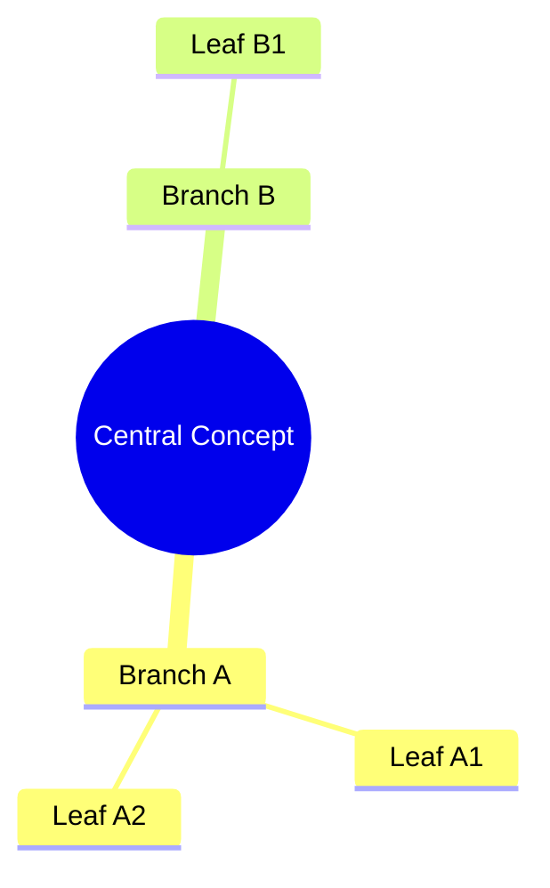
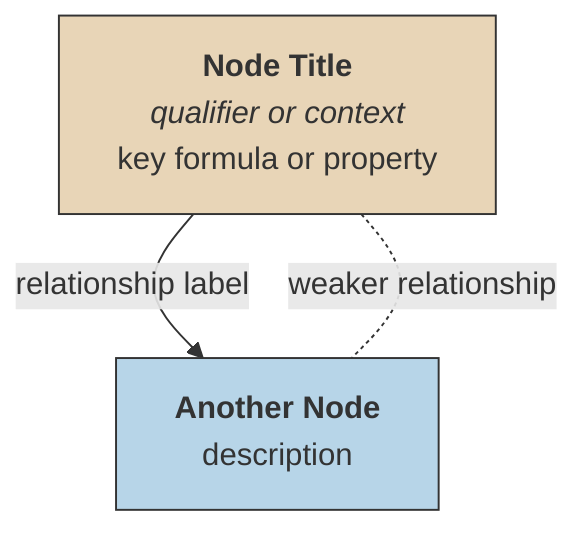

# Add Diagram

Adds Mermaid diagrams to existing Obsidian math notes. Obsidian renders Mermaid natively inside fenced code blocks.

## Before Adding a Diagram

1. **Read the target note** — understand its structure and content
2. **Decide diagram type** — pick the one that clarifies the concept best (see below)
3. **Place it where it helps** — near the content it illustrates, not just at the top or bottom

## Diagram Types for Math

| Type | Best for | Mermaid syntax |
|------|----------|----------------|
| Concept dependency | "Theorem X requires A, B, C" | `graph TD` with arrows into conclusion |
| Implication chain | "A ⟹ B ⟹ C but C ⟹̸ A" | `graph LR` with solid/dotted arrows |
| Classification | Types of convergence, spaces, integrals | `graph TD` tree structure |
| Proof structure | Key lemmas/steps leading to result | `graph TD` with labeled edges |
| Conceptual square | Two parallel generalizations | `graph TD` 2x2 grid layout |
| Mindmap | Topic overview, concept taxonomy, chapter map | `mindmap` with indentation hierarchy |

### Mindmap Syntax

Mindmaps use **indentation** (not arrows) to define hierarchy. Good for broad topic overviews where relationships are parent-child rather than directional implications.

**Node shapes:**

| Shape | Syntax | Use for |
|-------|--------|---------|
| Circle | `((Text))` | Root / central concept |
| Rounded | `(Text)` | Main branches |
| Square | `[Text]` | Sub-topics, definitions |
| Hexagon | `{{Text}}` | Key theorems, special nodes |
| Cloud | `)Text(` | Open questions, informal concepts |
| Bang | `))Text((` | Surprising results, counterexamples |

**Mindmap rules:**
- Indentation is relative — each line compared to previous only
- No arrows, no `style` blocks — hierarchy is the only structure
- Supports **bold** and *italic* via markdown strings
- Best for 8-15 nodes; use flowcharts if you need directional arrows or color coding

## Style Conventions

Follow the existing vault style (see `riesz-fischer-theorem.md` for reference):

### Rules

- **Bold titles** in nodes: `<b>Title</b>`
- **Italics** for qualifiers: `<i>f ∈ L²</i>`
- **Math in nodes** (Mermaid v10.9.0+): Wrap expressions with `$$` inside node labels for rendered math in flowcharts and sequence diagrams — e.g. `A["$$ \\sum_{n=1}^{\\infty} a_n $$"]`. Falls back to MathML natively; KaTeX CSS fallback available. **Caveat:** Depends on Obsidian's bundled Mermaid version supporting v10.9+. If rendering fails, fall back to Unicode math.
- **Unicode math** in labels (universal fallback): ∑, ≅, ℓ², ‖, ⊂, ∈, →, ⟹ — always works regardless of Mermaid version
- **Solid arrows** `-->` for strong dependencies (implies, generalizes, requires)
- **Dotted arrows** `-.-` for weaker relations (operates in, analogous to)
- **Color coding** for conceptual grouping:
  - Warm `#e8d5b7` — classical / source concepts
  - Cool `#b7d5e8` — modern / target concepts
  - Green `#d4edda` — central theorem / conclusion
- **Keep diagrams small** — 3-6 nodes max. A diagram with 10+ nodes is a wall of text with arrows.

### After Adding

- Add a brief paragraph below the diagram explaining how to read it (what the arrows and colors mean)
- Verify the note still renders correctly in Obsidian's preview
