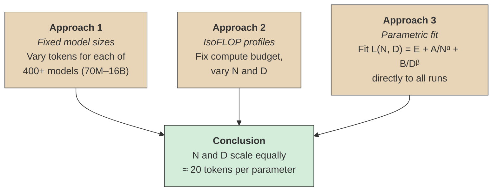
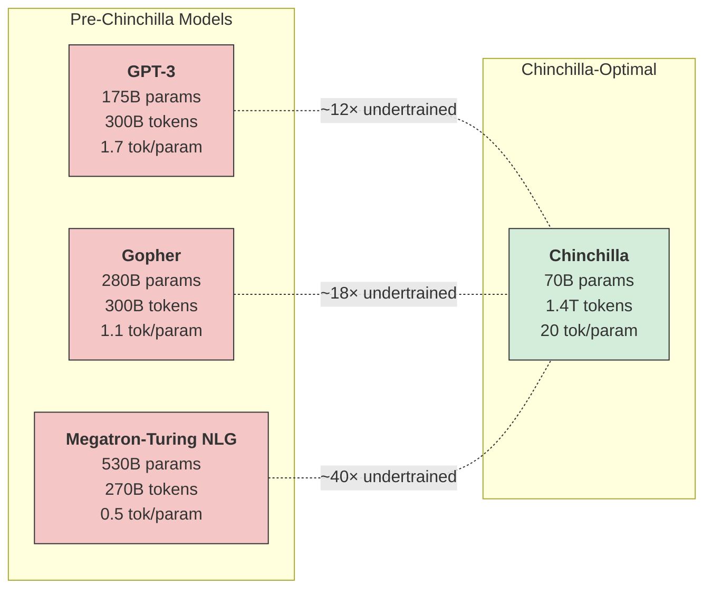
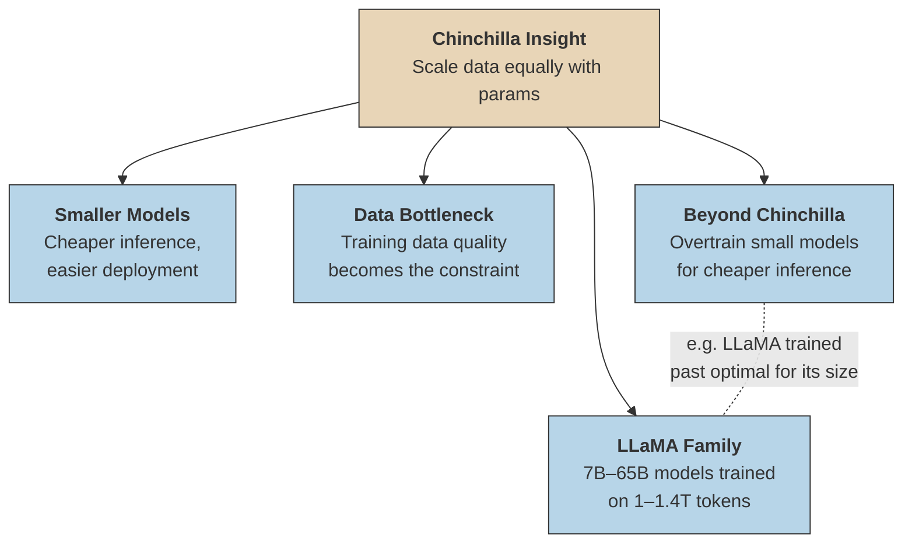
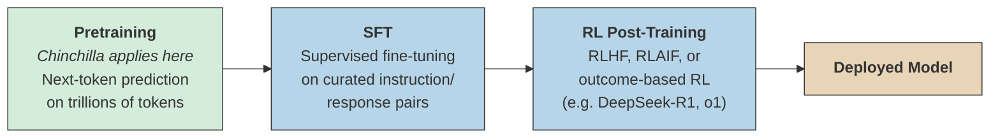

# Chinchilla Scaling Laws

**Paper:** [Training Compute-Optimal Large Language Models](https://arxiv.org/abs/2203.15556) — Hoffmann et al., DeepMind, 2022 (NeurIPS 2022)

## Core Claim

For a given compute budget, existing large language models are significantly **undertrained**. Model size and training data should be scaled **equally** — for every doubling of model size, the number of training tokens should also be doubled.

The optimal ratio is roughly **20 tokens per parameter**.

## The Scaling Law

### Compute Budget

Total training compute is approximated by:

$$C \approx 6ND$$

where $N$ is the number of parameters and $D$ is the number of training tokens. The factor of 6 accounts for both forward and backward passes across all operations.

### Parametric Loss Function

The final loss as a function of model size and data is:

$$L(N, D) = E + \frac{A}{N^\alpha} + \frac{B}{D^\beta}$$

with fitted values:

| Parameter | Value |
|-----------|-------|
| $A$ | $406.4$ |
| $\alpha$ | $0.34$ |
| $B$ | $410.7$ |
| $\beta$ | $0.28$ |
| $E$ | $1.69$ |

The first term $E$ is the irreducible loss (entropy of natural language). The second term captures how loss decreases with more parameters. The third captures how loss decreases with more data.

### Optimal Allocation

Given a fixed compute budget $C$, the optimal number of parameters and tokens both scale as the **square root** of compute:

$$N_{\text{opt}} \propto C^{0.50}, \qquad D_{\text{opt}} \propto C^{0.50}$$

This means parameters and data should grow at the **same rate** — a stark contrast to the prior Kaplan et al. scaling laws, which suggested spending most of the budget on larger models.

## Three Approaches, One Answer

The paper is notable for using three independent methods that all converge on the same conclusion:

The agreement across three different methodologies gives strong confidence in the result.

## How Undertrained Were Existing Models?

Every major model before Chinchilla was massively undertrained relative to its size. They invested heavily in parameters while starving the model of data.

### Concrete Example

At a budget of $10^{22}$ FLOPs:

| Strategy | Parameters | Tokens |
|----------|-----------|--------|
| **Chinchilla-optimal** | $\sim 9.1\text{B}$ | $\sim 182\text{B}$ |
| **Kaplan-optimal** (prior law) | $\sim 759\text{B}$ | $\sim 22\text{B}$ |

Same compute, radically different allocation — and the Chinchilla allocation wins.

At $10^{24}$ FLOPs, the gap widens:

| Strategy | Parameters | Tokens |
|----------|-----------|--------|
| **Chinchilla-optimal** | $\sim 91\text{B}$ | $\sim 1.8\text{T}$ |
| **Kaplan-optimal** | $\sim 759\text{B}$ | $\sim 220\text{B}$ |

## The Chinchilla Model

To validate the theory, DeepMind trained **Chinchilla**: a 70B parameter model on 1.4T tokens, using the same compute budget as the 280B parameter Gopher.

Results on MMLU (Massive Multitask Language Understanding):

| Model | Parameters | MMLU Accuracy |
|-------|-----------|---------------|
| Gopher | 280B | 60.0% |
| GPT-3 | 175B | 43.9% |
| Megatron-Turing NLG | 530B | 33.3% |
| **Chinchilla** | **70B** | **67.6%** |

Chinchilla — 4× smaller than Gopher — beat it by 7.6 percentage points. It also surpassed expert forecasts for June 2023 accuracy (63.4%) and achieved >90% on four individual MMLU tasks.

## Why It Matters

1. **Inference cost** — A compute-optimal model is smaller, so it's cheaper to serve. Chinchilla at 70B is far easier to deploy than Gopher at 280B, while performing better.
2. **Data becomes king** — The field shifted focus to data quality and quantity. Getting enough high-quality tokens became the bottleneck, not GPU count.
3. **Influenced LLaMA** — Meta's LLaMA models (2023) followed Chinchilla's philosophy: smaller models trained on much more data. LLaMA-7B was trained on 1T tokens (~140 tok/param), deliberately *overtraining* past Chinchilla-optimal to trade training compute for cheaper inference.
4. **"Beyond Chinchilla" strategies** — For deployment, it can make sense to train a model past its compute-optimal point. A smaller model that's overtrained costs less to serve per query, even if the training run was "wasteful" by Chinchilla standards.

## Scope: Pretraining Only

Chinchilla addresses **pretraining** exclusively — autoregressive next-token prediction on a text corpus. The paper came out in March 2022, the same month as InstructGPT, before the modern multi-stage pipeline became standard.

A frontier model's training today looks more like:

Chinchilla says nothing about:

- **SFT compute** — How much supervised fine-tuning data and how many passes over it are optimal
- **RL compute** — How to allocate FLOPs between pretraining and reinforcement learning. Models like OpenAI's o1/o3 and DeepSeek-R1 spend enormous compute on RL, which fundamentally reshapes what "compute-optimal" means
- **Inference-time compute** — Chain-of-thought, search, and verification at inference time (the "test-time compute" paradigm) didn't exist yet
- **Data mixing** — The optimal blend of code, math, web text, synthetic data, etc.

This is arguably the biggest gap in the Chinchilla framework for understanding 2025–2026 models. A lab's total compute budget now splits across pretraining, SFT, and RL — and the optimal *split* across stages is a separate (and largely unpublished) scaling question. It's entirely possible that for a fixed total budget, spending *less* on pretraining and *more* on RL yields a better model than Chinchilla-optimal pretraining alone.

## Limitations

- The law was derived for **autoregressive transformer LMs** — it may not transfer directly to other architectures or tasks.
- The fitted exponents depend on the specific training setup (optimizer, learning rate schedule, data distribution).
- At very large scales, the power-law relationship may break down or shift.
- The paper doesn't account for **inference cost** in its optimality criterion — it only optimizes for training loss per FLOP. Models deployed at scale may benefit from being smaller and overtrained.
- Recent work suggests the optimal ratio may be higher than 20 for some settings, and data quality matters as much as quantity.
- **Only covers one stage** of a multi-stage pipeline — see above.

## See Also
- [[Dense vs Moe|Dense vs MoE]] — Architectural choices in frontier models (2025–2026)
