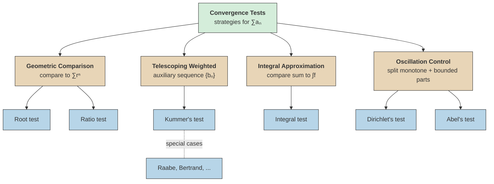

# Convergence Test Classification

A taxonomy of the main strategies for proving convergence of infinite series.

## Comparison with Geometric Decay

> [!abstract] Class: Geometric Comparison
> Tests in this class compare the terms of a series against a geometric series $\sum r^n$ to determine convergence.
>
> - **Root test** -- examines $\limsup |a_n|^{1/n}$ directly against $1$
> - **Ratio test** -- examines $\lim |a_{n+1}/a_n|$ against $1$

^geometric-comparison-class

> [!tip] Root test dominates
> If the root test is inconclusive, then the ratio test is also inconclusive; ==the root test is at least as powerful as the ratio test==.

## Telescoping Weighted Comparisons

> [!abstract] Class: Telescoping Weighted Comparisons
> These tests use an auxiliary sequence to create a telescoping structure, amplifying the differences between successive terms.
>
> - **Kummer's test** -- the general framework; convergence detected via $\liminf(b_n \cdot a_n / a_{n+1} - b_{n+1}) > 0$
> - **Ratio test, Raabe's test, Bertrand's test** -- special cases of Kummer's test with particular choices of $\{b_n\}$

^telescoping-weighted-class

## Integral Approximation

> [!abstract] Class: Integral Approximation
> Approximates a sum by an integral to determine convergence.
>
> - **Integral test** -- for monotone decreasing $f \geq 0$, $\sum f(n)$ converges if and only if $\int f$ converges

^integral-approximation-class

## Oscillation Control

> [!abstract] Class: Oscillation Control
> These tests handle series whose terms may change sign or oscillate, by separating monotone and bounded-variation behavior.
>
> - **Dirichlet's test** -- partial sums of $\{a_n\}$ bounded and $\{b_n\}$ bounded variation with $b_n \to 0$ implies $\sum a_n b_n$ converges
> - **Abel's test** -- $\sum a_n$ converges and $\{b_n\}$ bounded variation implies $\sum a_n b_n$ converges

^oscillation-control-class

## Overview

> [!info]- Diagram Reading Guide
> The four classes (warm nodes) represent distinct proof strategies. Each branches into specific tests (cool nodes). Kummer's test is the general framework for the telescoping class, with classical tests as special cases.

## See Also

- [[series-convergence-tests|Series Convergence Tests]] -- detailed statements of root, ratio, and condensation tests
- [[kummers-test|Kummer's Test]] -- the unifying framework for telescoping weighted comparisons
- [[dirichlets-convergence-test|Dirichlet's Convergence Test]]
- [[abels-test-for-convergence|Abel's Test for Convergence]]
