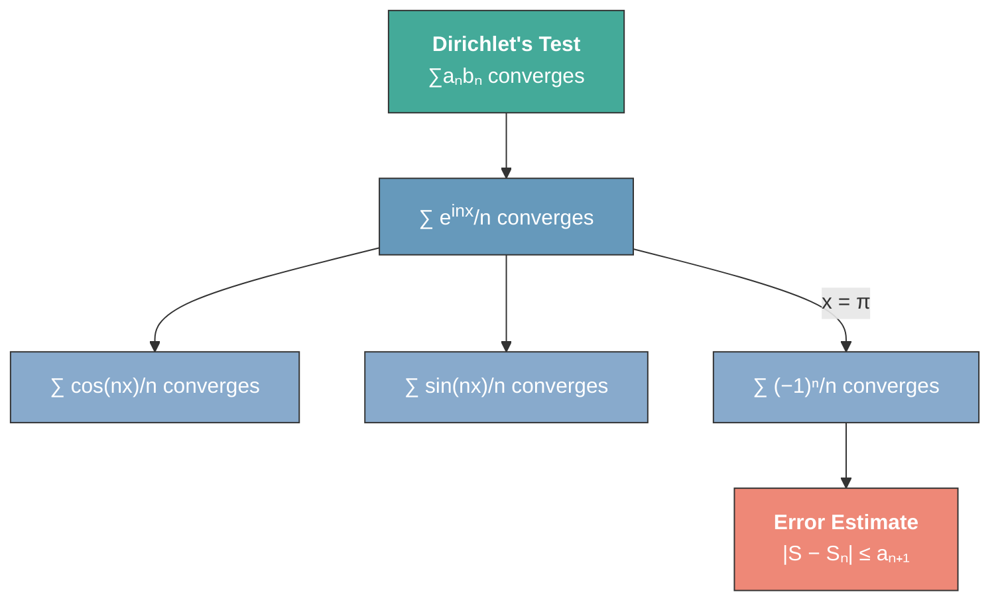

# Dirichlet's Convergence Test

## Statement

> [!abstract] Theorem (Dirichlet's Convergence Test)
> Let $S = \sum_{n=1}^{\infty} a_n b_n$. Suppose:
>
> 1. The partial sums $\sum a_n$ are **uniformly bounded** (the series need not converge).
> 2. $\{b_n\}$ is a sequence of **[[bounded-variation-sequences|bounded variation]]** converging to $0$.
>
> Then $S$ converges.

^dirichlets-test

**In particular**, if $\{b_n\}$ is a monotone sequence with $b_n \to 0$, then $\{b_n\}$ is automatically of bounded variation, so the conclusion holds.

## Applications

### Convergence of $\sum e^{inx}/n$

> [!example] Application: Complex Exponential Series
> Using Dirichlet's test, we can prove that
>
> $$\sum_{n=1}^{\infty} \frac{e^{inx}}{n} \text{ converges for all } x \in \mathbb{R}.$$
>
> Set $a_n = e^{inx}$ and $b_n = 1/n$. The partial sums $\sum_{n=1}^{N} e^{inx}$ are uniformly bounded (as a geometric sum), and $b_n = 1/n$ is a monotone decreasing sequence converging to $0$.

Since $e^{inx} = \cos(nx) + i\sin(nx)$, taking real and imaginary parts gives:

$$\sum_{n=1}^{\infty} \frac{\cos(nx)}{n} \quad \text{and} \quad \sum_{n=1}^{\infty} \frac{\sin(nx)}{n} \quad \text{converge for all real } x.$$

### Alternating Harmonic Series

It immediately follows from Dirichlet's test that

$$\sum_{n=1}^{\infty} \frac{(-1)^n}{n} \text{ converges.}$$

## Alternating Series Error Estimate

> [!abstract] Theorem (Alternating Series Error Estimate)
> Let $\{a_n\}$ be a decreasing monotone sequence with $a_n \to 0$. Define the alternating series
>
> $$S = \sum_{n=1}^{\infty} (-1)^{n-1} a_n,$$
>
> and let $S_n$ denote its $n$-th partial sum. Then
>
> $$|S - S_n| \leq a_{n+1}.$$

^alternating-series-error-estimate

> [!tip] Practical use
> This bound gives a practical way to determine how many terms one must compute to achieve an approximation accurate to $n$ decimal places: ==simply find the smallest $N$ such that $a_{N+1} < 10^{-n}$==.

## Application Chain

Dirichlet's test yields convergence of the complex exponential series, which splits into the real cosine and sine series. Setting $x = \pi$ immediately gives the alternating harmonic series, whose convergence is refined by the error estimate.

## See Also

- [[abel-summation-by-parts|Abel Summation by Parts]]
- [[bounded-variation-sequences|Bounded Variation Sequences]]
- [[absolute-convergence|Absolute Convergence]]
- [[series-convergence-tests|Series Convergence Tests]]
