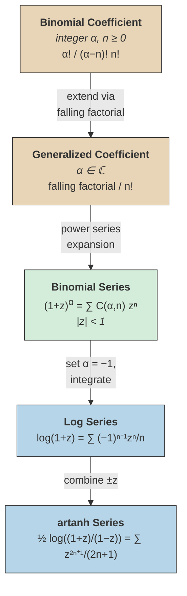

# Generalized Binomial Series

## Generalized Binomial Coefficients

> [!definition] Binomial Coefficient (Integer Case)
> For $\alpha$ a positive integer and $n \geq 0$ an integer:
>
> $$\binom{\alpha}{n} = \frac{\alpha!}{(\alpha - n)!\, n!} = \frac{\alpha(\alpha-1)(\alpha-2)\cdots(\alpha-n+1)}{n!}$$

The second expression — the **falling factorial form** — does not require computing $\alpha!$ or $(\alpha - n)!$, only the product of $n$ consecutive descending factors starting from $\alpha$.

> [!definition] Extension to Complex Parameters
> For any $\alpha \in \mathbb{C}$ and non-negative integer $n$, define:
>
> $$\binom{\alpha}{n} = \frac{\alpha(\alpha-1)(\alpha-2)\cdots(\alpha-n+1)}{n!}$$
>
> with $\binom{\alpha}{0} = 1$.

%%clarification: The falling factorial form makes sense for arbitrary complex $\alpha$ since it only involves $n$ multiplications and a division by $n!$, with no need for a factorial of $\alpha$ itself.%%

## Vandermonde Convolution

> [!theorem] Vandermonde Convolution
> For $\alpha, \beta \in \mathbb{C}$ and non-negative integer $n$:
>
> $$\binom{\alpha + \beta}{n} = \sum_{k=0}^{n} \binom{\alpha}{k}\binom{\beta}{n-k}$$

%%clarification: The upper limit is $n$ because $\binom{\beta}{n-k} = 0$ for $k > n$ (the generalized binomial coefficient vanishes for negative integer lower argument). The identity is established by extending the classical integer proof via the binomial series: compare coefficients of $z^n$ on both sides of $(1+z)^{\alpha+\beta} = (1+z)^\alpha(1+z)^\beta$.%%

## The Binomial Series

> [!theorem] Generalized Binomial Series
> For $\alpha \in \mathbb{C}$ and $|z| < 1$:
>
> $$(1 + z)^\alpha = \sum_{n=0}^{\infty} \binom{\alpha}{n} z^n$$

This extends the classical binomial theorem $(1+z)^n = \sum_{k=0}^{n}\binom{n}{k}z^k$ (which is a finite sum for non-negative integer $n$) to ==arbitrary complex exponents==, at the cost of requiring $|z| < 1$ for convergence.

%%clarification: When $\alpha$ is a non-negative integer, $\binom{\alpha}{n} = 0$ for $n > \alpha$ and the series reduces to the usual finite binomial expansion. The radius of convergence is $1$; convergence on $|z| = 1$ depends on $\alpha$.%%

## Logarithmic Series

> [!theorem] Logarithmic Series
> For $|z| < 1$:
>
> $$\log(1 + z) = \sum_{n=1}^{\infty} \frac{(-1)^{n-1}}{n}\, z^n = z - \frac{z^2}{2} + \frac{z^3}{3} - \cdots$$
>
> This is the Taylor series of $\log(1+z)$ about $z = 0$, valid since $\log(1+z)$ is analytic on $|z| < 1$.

Setting $z = 1$ recovers the [[exponential-logarithm-and-euler-constant|alternating harmonic series]] $\log 2 = \sum_{n=1}^{\infty} \frac{(-1)^{n-1}}{n}$.

%%clarification: The log series can be obtained from the binomial series by formally integrating $(1+z)^{-1} = \sum_{n=0}^{\infty}(-z)^n$ term by term, or equivalently by setting $\alpha = 0$ and differentiating the binomial series appropriately.%%

## The $\operatorname{artanh}$ Series

Since $\log\!\left(\frac{1+z}{1-z}\right) = \log(1+z) - \log(1-z)$, combining the two logarithmic series gives:

> [!theorem] Series for $\operatorname{artanh}$
> For $|z| < 1$:
>
> $$\frac{1}{2}\log\!\left(\frac{1+z}{1-z}\right) = \sum_{n=0}^{\infty} \frac{z^{2n+1}}{2n+1} = z + \frac{z^3}{3} + \frac{z^5}{5} + \cdots$$

%%clarification: The left-hand side equals $\operatorname{artanh}(z)$ for real $|z| < 1$. Only odd powers appear because the even-power terms cancel when subtracting $\log(1-z)$ from $\log(1+z)$.%%

This series converges more rapidly than the plain logarithmic series for computing $\log$ of numbers near $1$: to compute $\log a$, solve $\frac{1+z}{1-z} = a$ for $z = \frac{a-1}{a+1}$, which satisfies $|z| < 1$ whenever $a > 0$.

## Concept Map

The warm nodes (top) are the algebraic foundation; the green node is the central binomial series theorem; the cool nodes (bottom) are its logarithmic consequences. Each arrow shows how the next result follows from the previous.

## See Also

- [[power-series|Power Series]]
- [[exponential-logarithm-and-euler-constant|Exponential, Logarithm, and Euler's Constant]]
- [[trigonometric-series-identities|Trigonometric Series Identities]]
