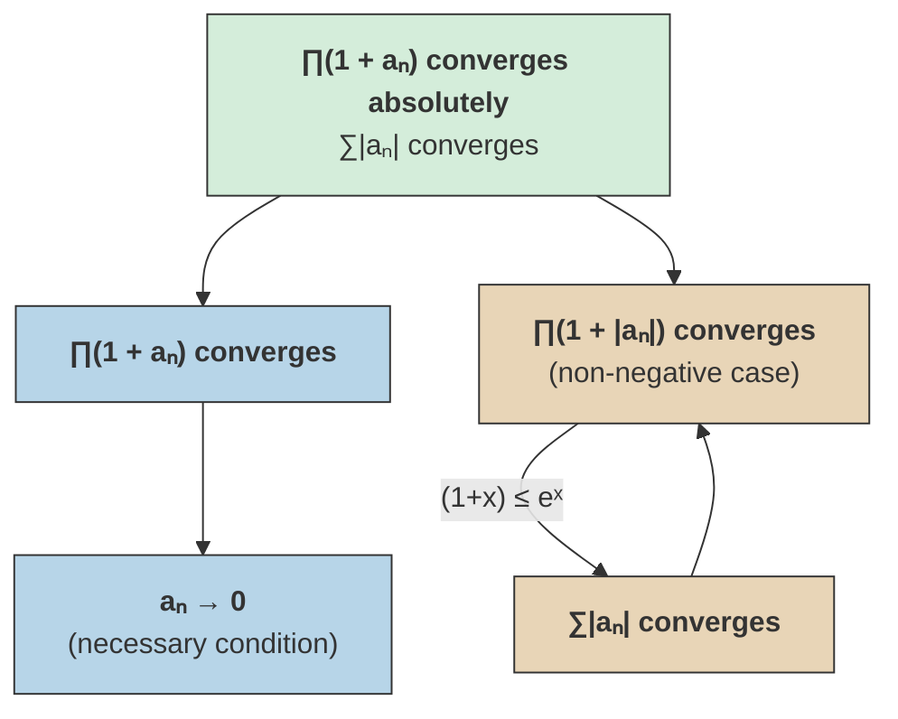

# Infinite Products

## Definition and Partial Products

Given a sequence $\{b_k\}$, the **infinite product** is defined as the limit of partial products:

$$\lim_{n \to \infty} \prod_{k=m}^{n} b_k = \lim_{n \to \infty} (b_m \cdot b_{m+1} \cdots b_n).$$

If this limit converges to some value $p$, then the full product starting from $k = 1$ is:

$$\lim_{n \to \infty} \prod_{k=1}^{n} b_k = b_1 \cdot b_2 \cdots b_{m-1} \cdot p$$

provided this is defined (i.e., none of the finitely many leading factors are problematic).

^infinite-product-definition

## Basic Properties

> [!abstract] Theorem (Necessary Condition for Convergence)
> If the infinite product $\prod_{n=1}^{\infty} b_n$ converges to a nonzero value, then $b_n \to 1$.

^factors-tend-to-one

> [!note]- Proof
> If $P_n = \prod_{k=1}^{n} b_k \to P \neq 0$, then $b_n = P_n / P_{n-1} \to P / P = 1$. $\blacksquare$

> [!abstract] Theorem (Convergence to Zero)
> The infinite product $\prod b_n$ converges to $0$ if and only if at least one factor $b_n = 0$.

%%clarification: Here "converges" for infinite products typically means the limit of partial products exists and is nonzero. A product that tends to 0 without a zero factor is said to "diverge to zero". The convention in the notes appears to be that convergence to 0 happens iff a factor is zero.%%

It is standard to write infinite products in the form $\prod (1 + a_n)$ where $a_n \to 0$.

## Convergence with Non-Negative Terms

> [!abstract] Theorem (Non-Negative Terms)
> If $a_n \geq 0$ for all $n$, then
>
> $$\prod_{n=1}^{\infty}(1 + a_n) \text{ converges} \quad \iff \quad \sum_{n=1}^{\infty} a_n \text{ converges.}$$

^nonneg-equivalence

## Absolute Convergence

> [!definition] Definition
> The infinite product $\prod (1 + a_n)$ **converges absolutely** if $\prod (1 + |a_n|)$ converges, i.e., if $\sum |a_n|$ converges.

> [!abstract] Theorem (Absolute Convergence Implies Convergence)
> If $\prod (1 + |a_n|)$ converges, then $\prod (1 + a_n)$ converges.

^absolute-convergence-products

This is ==the same relationship as for summation of series==: absolute convergence implies convergence.

## Comparison with Exponential

> [!tip] Key Estimate
> Using the inequality $(1 + x) \leq e^x$ valid for all real $x$:
>
> $$\prod (1 + a_n) \leq \prod e^{a_n} = e^{\sum a_n}.$$
>
> This provides an upper bound on the partial products and is the key tool in proving that $\sum a_n$ convergent implies $\prod(1 + a_n)$ convergent (for $a_n \geq 0$).

## Convergence Hierarchy

Absolute convergence (green) implies convergence. For non-negative terms (warm), the product and sum converge together, linked by the exponential bound. Convergence of any product forces factors to tend to 1 (cool).

## See Also

- [[eulers-product-formula-and-wallis|Euler's Product Formula and Wallis]]
- [[absolute-convergence|Absolute Convergence]]
- [[tannerys-theorem|Tannery's Theorem]]
- [[series-convergence-tests|Series Convergence Tests]]
