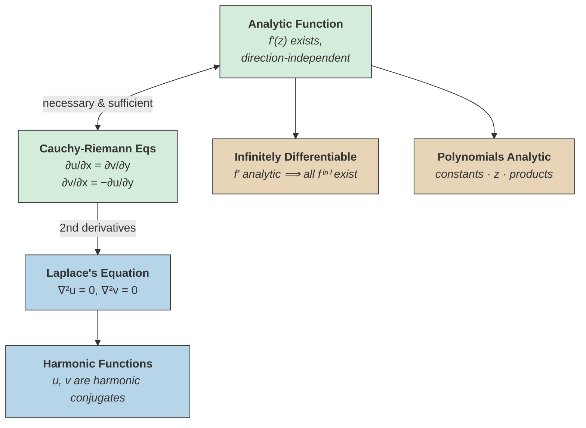

# Analytic Functions and the Cauchy-Riemann Equations

## The Riemann Sphere

> [!definition] Riemann Sphere
> The **Riemann Sphere** $\hat{\mathbb{C}} = \mathbb{C} \cup \{\infty\}$ is the one-point compactification of the complex plane. Geometrically, it is a sphere where:
> - The **north pole** maps to $\infty$
> - The **south pole** maps to $(0,0)$
>
> This extends $\mathbb{C}$ to include a point at infinity, enabling us to study the behavior of functions as $z \to \infty$.

%%The Riemann Sphere is constructed via stereographic projection from $S^2 \subset \mathbb{R}^3$ onto $\mathbb{C}$.%%

---

## Analytic Functions

> [!definition] Analytic Function
> A function $f : \mathbb{C} \to \mathbb{C}$ is **analytic** (or **holomorphic**) at a point $z$ if the limit
> $$f'(z) = \lim_{h \to 0} \frac{f(z+h) - f(z)}{h}$$
> exists, where $h \in \mathbb{C}$ may approach $0$ along **any direction** -- real or imaginary.

^def-analytic-function

What does it mean for a complex function $f(z)$ to be analytic at a point?
?
The limit $f'(z) = \lim_{h \to 0} \frac{f(z+h) - f(z)}{h}$ must exist, where $h \in \mathbb{C}$ can approach $0$ from any direction (real or imaginary). The derivative must be the same regardless of the path $h$ takes.

The key insight is that $h$ is a **complex** number, so it can approach $0$ along the real axis, the imaginary axis, or any other path. The derivative must be the same regardless of direction.

### Deriving the Derivative Along the Real Axis

Write $f(z) = u(x,y) + iv(x,y)$ where $z = x + iy$ and $u, v$ are real-valued functions. Taking $h \to 0$ along the **real axis** ($h \in \mathbb{R}$):

$$f'(z) = \frac{\partial u}{\partial x} + i\frac{\partial v}{\partial x}$$

### Deriving the Derivative Along the Imaginary Axis

Taking $h \to ih \to 0$ along the **imaginary axis** ($h = it$, $t \in \mathbb{R}$):

$$f'(z) = -i\frac{\partial u}{\partial y} + \frac{\partial v}{\partial y} = \frac{\partial v}{\partial y} - i\frac{\partial u}{\partial y}$$

---

## The Cauchy-Riemann Equations

Since both expressions must equal $f'(z)$, we equate real and imaginary parts:

$$\frac{\partial u}{\partial x} + i\frac{\partial v}{\partial x} = \frac{\partial v}{\partial y} - i\frac{\partial u}{\partial y}$$

> [!theorem] Cauchy-Riemann Equations
> If $f(z) = u(x,y) + iv(x,y)$ is analytic, then:
> $$\frac{\partial u}{\partial x} = \frac{\partial v}{\partial y} \qquad \text{and} \qquad \frac{\partial v}{\partial x} = -\frac{\partial u}{\partial y}$$

^cauchy-riemann-equations

What are the Cauchy-Riemann equations for $f(z) = u(x,y) + iv(x,y)$?
?
$\dfrac{\partial u}{\partial x} = \dfrac{\partial v}{\partial y}$ and $\dfrac{\partial v}{\partial x} = -\dfrac{\partial u}{\partial y}$. They arise from equating the derivative of $f$ taken along the real axis with the derivative taken along the imaginary axis.

> [!theorem] Cauchy-Riemann: Necessary and Sufficient
> The Cauchy-Riemann equations are a ==necessary and sufficient condition== for analyticity of $f(z)$ %%assuming $u$ and $v$ have continuous first partial derivatives%%.

^cr-iff-analytic

Are the Cauchy-Riemann equations necessary, sufficient, or both for analyticity?
?
Both necessary and sufficient (given that $u$ and $v$ have continuous first partial derivatives). A function $f(z) = u + iv$ is analytic if and only if the CR equations hold.

---

## Harmonic Functions and Laplace's Equation

Taking second-order mixed partial derivatives of the Cauchy-Riemann equations:

From $\dfrac{\partial u}{\partial x} = \dfrac{\partial v}{\partial y}$, differentiate with respect to $y$:

$$\frac{\partial^2 u}{\partial x \, \partial y} = \frac{\partial^2 v}{\partial y^2}$$

From $\dfrac{\partial v}{\partial x} = -\dfrac{\partial u}{\partial y}$, differentiate with respect to $x$:

$$\frac{\partial^2 v}{\partial x^2} = -\frac{\partial^2 u}{\partial x \, \partial y}$$

Adding these two results:

> [!theorem] Laplace's Equation
> If $f(z) = u + iv$ is analytic, then both $u$ and $v$ satisfy **Laplace's equation**:
> $$\frac{\partial^2 u}{\partial x^2} + \frac{\partial^2 u}{\partial y^2} = 0$$
> $$\frac{\partial^2 v}{\partial x^2} + \frac{\partial^2 v}{\partial y^2} = 0$$
> Equivalently, $\nabla^2 u = 0$ and $\nabla^2 v = 0$.

^laplaces-equation

> [!definition] Harmonic Function
> A function $\varphi(x,y)$ is **harmonic** if it satisfies Laplace's equation:
> $$\nabla^2 \varphi = \frac{\partial^2 \varphi}{\partial x^2} + \frac{\partial^2 \varphi}{\partial y^2} = 0$$

^def-harmonic

What is a harmonic function?
?
A twice continuously differentiable function $\varphi(x,y)$ satisfying Laplace's equation: $\nabla^2 \varphi = \frac{\partial^2 \varphi}{\partial x^2} + \frac{\partial^2 \varphi}{\partial y^2} = 0$. Both the real and imaginary parts of any analytic function are harmonic.

==The real and imaginary parts of any analytic function are harmonic.==

### Harmonic Conjugates

> [!definition] Harmonic Conjugate
> Given a harmonic function $u(x,y)$, the function $v(x,y)$ such that $f(z) = u + iv$ is analytic is called the **harmonic conjugate** of $u$. It can be found by integrating the Cauchy-Riemann equations:
> $$v(x,y) = \int \frac{\partial u}{\partial x} \, dy + g(x)$$
> where $g(x)$ is determined by the second CR equation.

---

## Properties of Analytic Functions

> [!theorem] Analyticity of Derivatives
> If $f(z)$ is analytic, then $f'(z)$ is also analytic. Consequently, ==analytic functions have analytic derivatives of every order==.

^analytic-derivatives

%%This is a striking difference from real analysis, where a differentiable function need not even be twice differentiable. In complex analysis, a single derivative guarantees infinitely many.%%

---

## Closure Properties

> [!theorem] Algebraic Closure of Analytic Functions
> - Every constant function is analytic
> - The identity function $f(z) = z$ is analytic
> - Products of analytic functions are analytic
>
> Hence, ==all polynomials in $z$ are analytic==.

^analytic-closure

### Rational Functions

> [!definition] Rational Function
> A **rational function** is a quotient of polynomials:
> $$R(z) = \frac{P(z)}{Q(z)}$$
> A rational function of order $p$ has $p$ zeros, $p$ poles, and $p$ roots %%counting multiplicity%%.

Rational functions are analytic everywhere except at their poles (zeros of $Q(z)$).

---

## Cauchy Sequences in $\mathbb{C}$

> [!theorem] Cauchy Criterion in $\mathbb{C}$
> A real or complex sequence is convergent if and only if it is a [[cauchy-sequences|Cauchy sequence]].

^cauchy-criterion-complex

%%A complex sequence $(z_n)$ is Cauchy if $|z_m - z_n| \to 0$ as $m, n \to \infty$. Since $\mathbb{C} \cong \mathbb{R}^2$ is complete, this is equivalent to convergence.%%

---

## Concept Map

Green nodes are the central equivalence: a function is analytic if and only if it satisfies the Cauchy-Riemann equations. Cool nodes show the path from CR to harmonic functions via Laplace's equation. Warm nodes are consequences of analyticity — infinite differentiability and algebraic closure under standard operations.

## See Also

- [[cauchy-sequences|Cauchy Sequences]] -- completeness of $\mathbb{C}$
- [[power-series|Power Series]] -- analytic functions have local power series representations
- [[exponential-logarithm-and-euler-constant|Exponential, Logarithm, and Euler Constant]] -- fundamental analytic functions
- [[field-axioms|Field Axioms]] -- algebraic structure underlying $\mathbb{C}$
- [[metric-spaces|Metric Spaces]] -- completeness and convergence in general
- [[continuous-functions|Continuous Functions]] -- analyticity implies continuity
- [[uniform-convergence-and-cauchy-criterion|Uniform Convergence and Cauchy Criterion]] -- convergence criteria for function sequences
