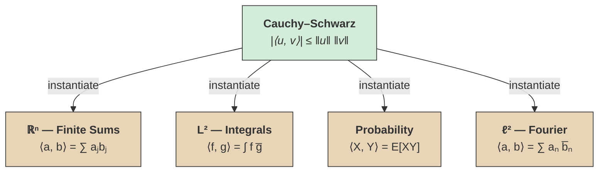
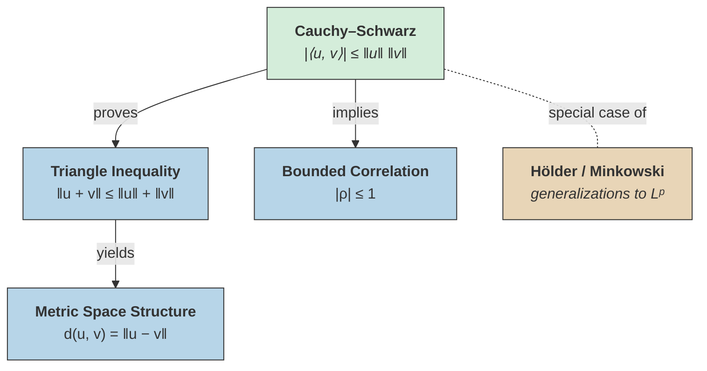

# Cauchy–Schwarz Inequality

## Core Idea

> [!abstract] Theorem (Cauchy–Schwarz)
> The Cauchy–Schwarz inequality says that the **inner product of two vectors is at most the product of their lengths**:
>
> $$|\langle u, v \rangle| \leq \|u\| \cdot \|v\|.$$

^cauchy-schwarz-inequality

This is really a statement about projections: **the component of $u$ in the direction of $v$ can never exceed the full magnitude of $u$.** Geometrically, $\langle u, v \rangle = \|u\|\|v\|\cos\theta$, and $|\cos\theta| \leq 1$ does all the work. The inequality is tight exactly when $\theta = 0$ or $\pi$ — i.e., ==when the vectors are proportional==.

What makes Cauchy–Schwarz so ubiquitous is that this single geometric fact takes on a different disguise in every setting that carries a notion of "inner product": finite sums, integrals, expectations, series. The dozens of formulations are all the same inequality wearing different clothes.

### Why It Shows Up Everywhere

> [!tip] Universality
> Any mathematical structure that admits an inner product ==automatically inherits Cauchy–Schwarz==. The inequality is not independently discovered in each setting — it is the *same* abstract theorem instantiated in different spaces.

- Functions are square-integrable? Inner product $\langle f, g \rangle = \int f\bar{g}$. Cauchy–Schwarz follows.
- Random variables have finite variance? Inner product $\langle X, Y \rangle = E[XY]$. Cauchy–Schwarz gives bounded correlation.
- [[fourier-series|Fourier coefficients]] live in $\ell^2$? Inner product $\langle a, b \rangle = \sum a_n \bar{b}_n$. Cauchy–Schwarz again.



The green node is the single abstract theorem; each warm node is a concrete setting that inherits it by defining an inner product. Every "formulation" below is just one of these instantiations.

> [!info]- Inherited Structure Chain
> More broadly, defining an inner product triggers a chain of inherited structure:
>
> ```mermaid
> graph LR
>     IP["<b>Inner Product</b><br/><i>⟨u, v⟩</i>"]
>     N["<b>Norm</b><br/><i>‖u‖ = √⟨u, u⟩</i>"]
>     CS["<b>Cauchy–Schwarz</b><br/><i>|⟨u, v⟩| ≤ ‖u‖ ‖v‖</i>"]
>     TI["<b>Triangle Inequality</b><br/><i>‖u + v‖ ≤ ‖u‖ + ‖v‖</i>"]
>     M["<b>Metric</b><br/><i>d(u, v) = ‖u − v‖</i>"]
>
>     IP -- "defines" --> N
>     N -- "implies" --> CS
>     CS -- "proves" --> TI
>     TI -- "yields" --> M
>
>     style IP fill:#e8d5b7,stroke:#333
>     style N fill:#e8d5b7,stroke:#333
>     style CS fill:#d4edda,stroke:#333
>     style TI fill:#b7d5e8,stroke:#333
>     style M fill:#b7d5e8,stroke:#333
> ```
>
> Read left to right: choosing an inner product is the single design decision. Everything to the right — norm, Cauchy–Schwarz, triangle inequality, full metric — follows automatically. Warm nodes are the starting structure, green is the inequality itself, and cool nodes are the downstream consequences.

So any concept in mathematics that can be cast into the language of linear algebra — anything with a legitimate inner product — gets its own Cauchy–Schwarz inequality for free, along with the entire metric space structure that follows.

## Statement (Finite Sums)

> [!abstract] Theorem (Cauchy–Schwarz, Finite Sums)
> Let $a_1, \ldots, a_n$ and $b_1, \ldots, b_n$ be complex numbers. Then
>
> $$\left| \sum_{j=1}^{n} a_j b_j \right|^2 \leq \left( \sum_{j=1}^{n} |a_j|^2 \right) \left( \sum_{j=1}^{n} |b_j|^2 \right).$$

^cauchy-schwarz-finite-sums

This is one of the various forms of this inequality. Equality holds if and only if the vectors $(a_1, \ldots, a_n)$ and $(b_1, \ldots, b_n)$ are proportional.

## Other Formulations

**Integrals.** For square-integrable functions $f, g$:

$$\left| \int f \, g \right|^2 \leq \int |f|^2 \int |g|^2.$$

**Probability.** For random variables $X, Y$ with finite variance:

$$|\text{Cov}(X, Y)|^2 \leq \text{Var}(X) \cdot \text{Var}(Y).$$

This is why the correlation coefficient satisfies $|\rho| \leq 1$.

**Inner product spaces.** In any inner product space, $|\langle u, v \rangle|^2 \leq \langle u, u \rangle \cdot \langle v, v \rangle$. ==All the forms above are special cases.==

## Applications

The Cauchy–Schwarz inequality implies the **triangle inequality** for the Euclidean metric on $\mathbb{R}^n$: given a [[metric-spaces|metric space]] with the standard distance, one can use Cauchy–Schwarz to show

$$d(p, q) \leq d(p, r) + d(r, q).$$



Green is Cauchy–Schwarz itself. Cool nodes are consequences it directly establishes. The warm node (Holder/Minkowski) is the reverse direction — Cauchy–Schwarz is the $p = 2$ special case of these broader $L^p$ inequalities, shown with a dotted line.

## See Also
- [[metric-spaces|Metric Spaces]]
- [[l2-spaces|L² Spaces]] — the inequality extends to square-integrable functions
