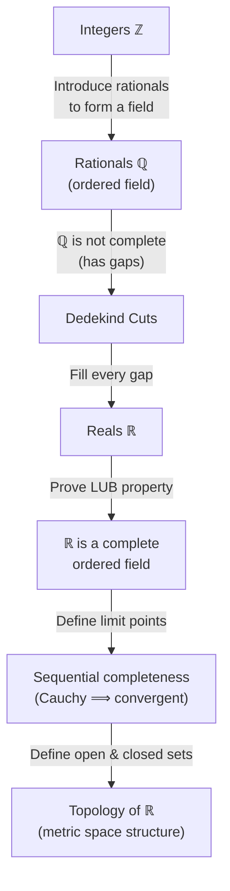

# Construction of the Real Numbers

> [!info] Motivation
> The real numbers are not simply "given" — they must be **constructed** from simpler number systems. This note traces the logical roadmap from the integers to a complete ordered field, and then onward to the topological concepts that completeness enables.

## Step 1: From Integers to Rationals

Starting from $\mathbb{Z}$, we introduce the **rational numbers** $\mathbb{Q}$ as equivalence classes of pairs $(p, q)$ with $p, q \in \mathbb{Z}$, $q \neq 0$. The rationals inherit addition and multiplication that satisfy the [[field-axioms|Field Axioms]], making $\mathbb{Q}$ into an **ordered field**.

> [!definition] Ordered Field
> A field $F$ equipped with a total order $<$ such that:
> 1. If $a < b$, then $a + c < b + c$ for all $c \in F$.
> 2. If $a < b$ and $c > 0$, then $ac < bc$.

What makes $\mathbb{Q}$ an ordered field?
?
$\mathbb{Q}$ satisfies all [[field-axioms|Field Axioms]] (closure, associativity, commutativity, distributivity, existence of additive and multiplicative identities and inverses) and admits a total order compatible with its arithmetic operations.

## Step 2: The Rationals Are Not Complete

Despite being an ordered field, ==$\mathbb{Q}$ has "gaps"== — bounded sets that lack a least upper bound within $\mathbb{Q}$.

> [!example] Classic Gap in $\mathbb{Q}$
> The set $S = \{q \in \mathbb{Q} : q^2 < 2\}$ is bounded above in $\mathbb{Q}$, but $\sup S = \sqrt{2} \notin \mathbb{Q}$. No rational number serves as its least upper bound.

This failure motivates the construction of a larger number system that "fills in" every such gap.

Why are the rationals not complete?
?
There exist bounded subsets of $\mathbb{Q}$ whose least upper bound is not rational. For instance, $\{q \in \mathbb{Q} : q^2 < 2\}$ is bounded above but has no supremum in $\mathbb{Q}$, since $\sqrt{2} \notin \mathbb{Q}$.

## Step 3: Dedekind Cuts

> [!definition] Dedekind Cut
> A **Dedekind cut** is a partition of $\mathbb{Q}$ into two non-empty sets $(A, B)$ such that:
> 1. Every element of $A$ is less than every element of $B$.
> 2. $A$ has **no greatest element**.
>
> Each cut identifies a "point" on the number line — either a rational number or an irrational one filling a gap.

What is a Dedekind cut?
?
A partition of $\mathbb{Q}$ into two non-empty sets $(A, B)$ where every element of $A$ is less than every element of $B$, and $A$ has no greatest element. Each cut represents a real number.

The collection of all Dedekind cuts, equipped with natural definitions of addition, multiplication, and order, forms the **real numbers** $\mathbb{R}$.

## Step 4: $\mathbb{R}$ Is a Complete Ordered Field

> [!theorem] Least Upper Bound Property
> Every non-empty subset of $\mathbb{R}$ that is bounded above has a **least upper bound** (supremum) in $\mathbb{R}$.

This is the defining property that distinguishes $\mathbb{R}$ from $\mathbb{Q}$. It is equivalent to saying that ==$\mathbb{R}$ has no gaps==.

What is the Least Upper Bound Property of $\mathbb{R}$?
?
Every non-empty subset of $\mathbb{R}$ that is bounded above has a supremum in $\mathbb{R}$. This is the completeness axiom that distinguishes $\mathbb{R}$ from $\mathbb{Q}$.

> [!note] Ordered + LUB = Complete
> An ordered field with the least upper bound property is called **complete**. The real numbers are (up to isomorphism) the unique complete ordered field.

## Step 5: Limit Points and Completeness of $\mathbb{R}$

> [!definition] Limit Point
> A point $x \in \mathbb{R}$ is a **limit point** of a set $S \subseteq \mathbb{R}$ if every neighborhood of $x$ contains a point of $S$ distinct from $x$.

With limit points defined, one can show that $\mathbb{R}$ is **complete** in the sequential sense: every [[cauchy-sequences|Cauchy sequence]] in $\mathbb{R}$ converges to a limit in $\mathbb{R}$.

> [!theorem] Completeness of $\mathbb{R}$ (Sequential Form)
> Every [[cauchy-sequences|Cauchy sequence]] in $\mathbb{R}$ is a [[convergent-sequences|convergent sequence]].

What does it mean for $\mathbb{R}$ to be complete in the sequential sense?
?
Every [[cauchy-sequences|Cauchy sequence]] in $\mathbb{R}$ converges to a limit in $\mathbb{R}$. Equivalently, $\mathbb{R}$ has no "missing" limits.

## Step 6: Open Sets, Closed Sets, and Limit Points

> [!definition] Open and Closed Sets
> - A set $U \subseteq \mathbb{R}$ is **open** if for every $x \in U$, there exists $\epsilon > 0$ such that $(x - \epsilon, x + \epsilon) \subseteq U$.
> - A set $F \subseteq \mathbb{R}$ is **closed** if it contains all of its limit points.

These two notions are dual: ==a set is closed if and only if its complement is open==. This connection between limit points and closed sets is the bridge from the algebraic construction of $\mathbb{R}$ into the realm of topology and [[metric-spaces|Metric Spaces]].

What is the relationship between closed sets and limit points?
?
A set $F \subseteq \mathbb{R}$ is closed if and only if it contains all of its limit points. Equivalently, $F$ is closed if and only if $\mathbb{R} \setminus F$ is open.

## The Full Roadmap

$$
\mathbb{Z} \xrightarrow{\text{form quotients}} \mathbb{Q} \xrightarrow{\text{Dedekind cuts}} \mathbb{R}
$$

## See Also

- [[field-axioms|Field Axioms]] — the algebraic structure that $\mathbb{Q}$ and $\mathbb{R}$ satisfy
- [[supremum-and-infimum|Supremum and Infimum]] — the least upper bound concept central to completeness
- [[cauchy-sequences|Cauchy Sequences]] — sequential characterization of completeness
- [[convergent-sequences|Convergent Sequences]] — the target of Cauchy sequences in $\mathbb{R}$
- [[metric-spaces|Metric Spaces]] — the general framework for open sets, closed sets, and completeness
- [[compactness|Compactness]] — a deeper topological property built on open and closed sets
- [[continuous-functions|Continuity]] — functions preserving the topological structure of $\mathbb{R}$
