# Stone-Weierstrass Theorem

## Weierstrass Approximation Theorem

> [!abstract] Theorem (Weierstrass Approximation)
> If $f$ is a continuous complex-valued function on $[a, b]$, then there exists a sequence of polynomials $\{P_n\}$ such that
>
> $$\lim_{n \to \infty} P_n(x) = f(x) \text{ uniformly on } [a, b].$$
>
> ==Every continuous function on a closed bounded interval can be approximated to arbitrary precision by polynomials==, with uniform convergence.
<!--SR:!2026-02-27,3,250-->

^weierstrass-approximation-theorem

<!-- clarification: The notes title this "Stone-Weierstrass" but the stated result is the classical Weierstrass Approximation Theorem (1885), which is a special case. The general Stone-Weierstrass theorem extends this to subalgebras of C(X) that separate points. -->

**Proof method:** By construction.

## Density Interpretation

Equivalently, the polynomials are ==**dense** in $C([a, b])$== under the sup-norm $\|\cdot\|_\infty$. For any continuous $f$ and any $\epsilon > 0$, there exists a polynomial $P$ with
<!--SR:!2026-02-25,1,230-->

$$\|f - P\|_\infty < \epsilon.$$

## General Stone-Weierstrass Theorem (Real Case)

> [!abstract] Definition (Separates Points)
> An algebra $\mathscr{A}$ of functions on $K$ **separates points** if for every $x \neq y$ in $K$, there exists $f \in \mathscr{A}$ such that $f(x) \neq f(y)$.

^separates-points

> [!abstract] Definition (Vanishes Nowhere)
> An algebra $\mathscr{A}$ **vanishes nowhere** on $K$ if for every $x \in K$, there exists $f \in \mathscr{A}$ such that $f(x) \neq 0$.

^vanishes-nowhere

> [!abstract] Theorem (Stone-Weierstrass, Real Case)
> If $\mathscr{A}$ is an algebra of real continuous functions on a compact set $K$ such that:
>
> 1. $\mathscr{A}$ **separates points** on $K$, and
> 2. $\mathscr{A}$ **vanishes nowhere** on $K$,
>
> then the uniform closure of $\mathscr{A}$ is the set of all real continuous functions on $K$. That is, ==$\mathscr{A}$ is **dense** in $C(K, \mathbb{R})$== under $\|\cdot\|_\infty$.
<!--SR:!2026-02-27,3,250-->

^stone-weierstrass-real

What are the two hypotheses of Stone-Weierstrass, and what do they give you?
?
An algebra $\mathscr{A} \subset C(K, \mathbb{R})$ on compact $K$ must (1) **separate points** ($\forall x \neq y$, $\exists f$ with $f(x) \neq f(y)$) and (2) **vanish nowhere** ($\forall x$, $\exists f$ with $f(x) \neq 0$). Then $\overline{\mathscr{A}} = C(K, \mathbb{R})$ — the algebra is dense in continuous functions under $\|\cdot\|_\infty$.
<!--SR:!2026-02-26,2,248-->

Polynomials on $[a, b]$ satisfy both conditions, making the classical Weierstrass theorem a special case.

## Complex Case

> [!warning] Additional hypothesis required
> For complex-valued functions, the theorem requires an additional hypothesis: $\mathscr{A}$ must be **self-adjoint**, meaning if $f \in \mathscr{A}$ then $\bar{f} \in \mathscr{A}$ (closure under complex conjugation).

> [!abstract] Theorem (Stone-Weierstrass, Complex Case)
> If $\mathscr{A}$ is a self-adjoint algebra of complex continuous functions on a compact set $K$ that separates points and vanishes nowhere, then $\mathscr{A}$ is dense in $C(K, \mathbb{C})$.

^stone-weierstrass-complex

What additional hypothesis does Stone-Weierstrass require over $\mathbb{C}$?
?
**Self-adjointness**: $f \in \mathscr{A} \Rightarrow \bar{f} \in \mathscr{A}$. Needed because separating points alone is insufficient — holomorphic functions on $\bar{D}$ separate points and vanish nowhere but aren't dense in $C(\bar{D}, \mathbb{C})$.
<!--SR:!2026-02-26,2,248-->

<!-- clarification: Self-adjointness is automatically satisfied in the real case since f = f̄ for real-valued functions. The complex case fails without it — e.g. the algebra of holomorphic functions on the closed unit disk separates points and vanishes nowhere, but is not dense in C(D̄, ℂ). -->

## The Generalization Chain

```mermaid
graph TD
    SWR["<b>Stone–Weierstrass (Real)</b><br/><i>𝒜 ⊂ C(K, ℝ), K compact</i><br/>separates points + vanishes nowhere<br/>⟹ 𝒜̄ = C(K, ℝ)"]
    WAT["<b>Weierstrass (1885)</b><br/><i>𝒜 = ℝ[x] on [a, b]</i><br/>Pₙ → f uniformly"]
    SWC["<b>Stone–Weierstrass (Complex)</b><br/><i>+ self-adjoint: f ∈ 𝒜 ⟹ f̄ ∈ 𝒜</i><br/>⟹ 𝒜̄ = C(K, ℂ)"]
    EX["<b>Key Instances</b><br/>Trig polys dense in C([0, 2π])<br/>Müntz: span{xᵏⁿ} dense iff Σ1/λₙ = ∞"]

    SWR -- "K = [a,b], 𝒜 = polynomials" --> WAT
    SWR -- "extend to ℂ" --> SWC
    SWR -- "instantiate" --> EX

    style SWR fill:#d4edda,stroke:#333,stroke-width:2px
    style WAT fill:#e8d5b7,stroke:#333
    style SWC fill:#b7d5e8,stroke:#333
    style EX fill:#e8d5b7,stroke:#333
```

> [!info]- Diagram Reading Guide
> - **Green node**: The central theorem — Stone's generalization to arbitrary subalgebras of $C(K, \mathbb{R})$. All other results flow from it.
> - **Cool blue**: The complex extension — identical hypotheses plus self-adjointness (closure under conjugation), needed because holomorphic functions can separate points without being dense.
> - **Warm nodes**: Classical and concrete results. Weierstrass is the historical starting point; the key instances show other algebras satisfying Stone's conditions.
> - **Solid arrows**: specialization or extension — labels describe what changes at each step.

## Examples of Dense Subalgebras

> [!example] Trigonometric polynomials
> Finite linear combinations of $\{1, \cos(nx), \sin(nx)\}$ are dense in $C([0, 2\pi])$. This is the foundation of [[fourier-series|Fourier Series]]: any continuous periodic function can be uniformly approximated by trigonometric polynomials. Equivalently, the complex exponentials $\text{span}\{e^{inx} : n \in \mathbb{Z}\}$ are dense on compact intervals.

> [!example] Muntz polynomials
> The span of $\{1, x^{\lambda_1}, x^{\lambda_2}, \ldots\}$ is dense in $C([0,1])$ if and only if $\sum 1/\lambda_n = \infty$ (Muntz-Szasz theorem). Not all integer powers are needed — e.g. $\{1, x, x^3, x^5, \ldots\}$ suffices since $\sum 1/(2n-1)$ diverges.

> [!example] Any algebra generated by a separating function
> For example, the algebra generated by $\{1, e^x\}$ on $[a, b]$ is dense, since $e^x$ is injective (separates points) and the algebra contains constants (vanishes nowhere).

## See Also
- [[uniform-convergence-and-cauchy-criterion|Uniform Convergence and Cauchy Criterion]]
- [[equicontinuity|Equicontinuity]]
- [[fourier-series|Fourier Series]]
- Polynomials
