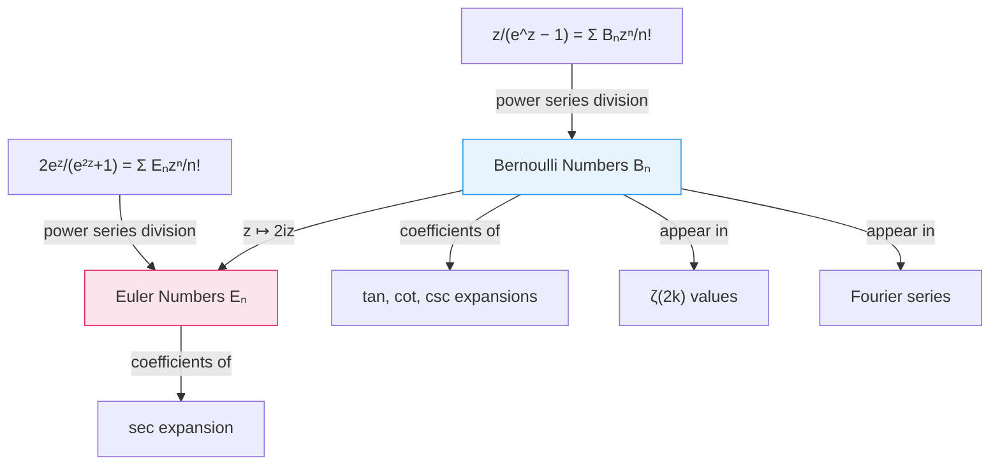

# Bernoulli and Euler Numbers

## Bernoulli Numbers

> [!abstract] Definition (Bernoulli Numbers)
> The **Bernoulli numbers** $B_n$ are defined by the generating function
>
> $$\frac{z}{e^z - 1} = \sum_{n=0}^{\infty} \frac{B_n}{n!} z^n.$$
>
> This is an instance of [[power-series|power series]] division: the left side is $z$ divided by the power series $e^z - 1$, which is valid since $e^z - 1$ has a simple zero at $z = 0$ (multiply numerator and denominator by $e^{-z/2}$ to see the quotient is well-defined).

^bernoulli-numbers-def

### Properties

- ==All Bernoulli numbers are **rational**==.
- The odd-indexed Bernoulli numbers vanish: $B_n = 0$ for odd $n \geq 3$, apart from $B_1$.
- **Recurrence**: $B^{n+1} = (B+1)^{n+1}$, interpreted symbolically by replacing $B^k$ with $B_k$ after expanding.

> [!example] First few values
> | $n$ | $B_n$ |
> |-----|-------|
> | $0$ | $1$ |
> | $1$ | $-\frac{1}{2}$ |
> | $2$ | $\frac{1}{6}$ |
> | $3$ | $0$ |
> | $4$ | $-\frac{1}{30}$ |

### Trigonometric Expansions

> [!tip] Connection to trigonometric functions
> Most trigonometric functions (apart from $\sec z$) can be expanded in terms of Bernoulli numbers. While $\sin z$ and $\cos z$ have straightforward power series, the functions $\tan z$, $\cot z$, and $\csc z$ involve $B_n$ in their coefficients.

%%clarification: To derive these expansions, start from the generating function definition and replace z with 2iz, then use the relationship between exponentials and trigonometric functions.%%

## Euler Numbers

> [!abstract] Definition (Euler Numbers)
> The **Euler numbers** $E_n$ are defined by the generating function
>
> $$\frac{2e^z}{e^{2z} + 1} = \sum_{n=0}^{\infty} \frac{E_n}{n!} z^n.$$

^euler-numbers-def

### Properties

- $E_0 = 1$.
- ==All odd-indexed Euler numbers are zero==: $E_n = 0$ for odd $n$.
- **Recurrence**: $(E+1)^{2n} + (E-1)^{2n} = 0$, interpreted symbolically.
- ==All Euler numbers are **integers**==.

> [!info]- Relationship to Bernoulli numbers
> The Euler numbers arise naturally from the Bernoulli numbers by substituting $z \mapsto 2iz$ in the generating function and separating real and imaginary parts. The secant function $\sec z = 1/\cos z$ has a power series expansion whose coefficients are expressible in terms of Euler numbers.

## Connections

## See Also

- [[power-series|Power Series]] — generating functions as power series division
- [[exponential-logarithm-and-euler-constant|Exponential, Logarithm, and Euler Constant]] — the exponential function $e^z$ underlying both definitions
- [[fourier-series|Fourier Series]] — Bernoulli numbers appear in Fourier expansions
- [[hyperbolic-functions|Hyperbolic Functions]] — closely related via $e^z$
