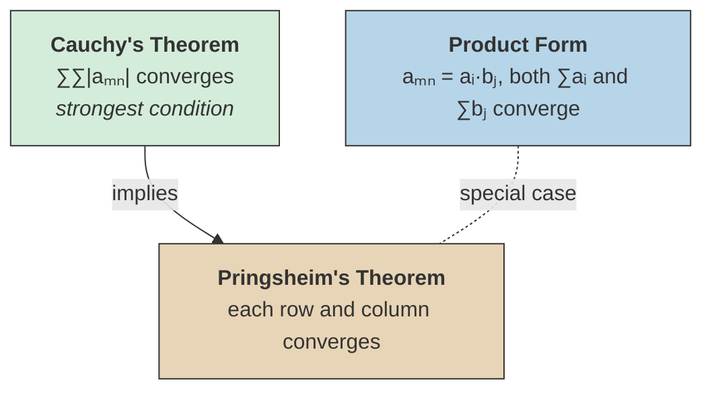

# Double Series

## Definition

> [!abstract] Definition (Double Series)
> A **double series** is a sum over a doubly-indexed sequence $\{a_{mn}\}$:
>
> $$\sum_{m=1}^{\infty} \sum_{n=1}^{\infty} a_{mn}.$$

^double-series-definition

> [!question] Central question
> When can the order of summation be interchanged, i.e., when does
>
> $$\sum_{m=1}^{\infty} \sum_{n=1}^{\infty} a_{mn} = \sum_{n=1}^{\infty} \sum_{m=1}^{\infty} a_{mn}$$
>
> hold?

## Product Form

Suppose $a_{mn} = a_i \cdot b_j$ (the double sequence factors as a product) and suppose both $\sum_{i=0}^{\infty} a_i$ and $\sum_{j=0}^{\infty} b_j$ converge. Then

$$\sum_{i=0}^{\infty} \sum_{j=0}^{\infty} a_i \cdot b_j = \left(\sum_{i=0}^{\infty} a_i\right)\left(\sum_{j=0}^{\infty} b_j\right).$$

<!-- clarification: This is a direct consequence of the algebraic identity for finite sums extended to infinite series via the convergence hypothesis. Compare with the Cauchy product in [[absolute-convergence|Absolute Convergence]]. -->

## Pringsheim's Theorem

Consider the double sequence arranged in a grid with $a_i$ along one axis and $b_j$ along the other. We can sum in either direction first, provided both iterated sums converge.

> [!abstract] Theorem (Pringsheim)
> If each column and each row of the double series converges, then the double series converges and we can sum in any order:
>
> $$\sum_{m=1}^{\infty} \sum_{n=1}^{\infty} a_{mn} = \sum_{n=1}^{\infty} \sum_{m=1}^{\infty} a_{mn}.$$

^pringsheims-theorem

<!-- clarification: The classical statement of Pringsheim's theorem requires additional conditions beyond mere row and column convergence (e.g., that the double series converges in the sense of Pringsheim, meaning the rectangular partial sums converge). The scan records the informal version presented in lecture. -->

## Cauchy's Double Series Theorem

> [!abstract] Theorem (Cauchy's Double Series Theorem)
> If $\sum a_{mn}$ converges absolutely, then you can switch the summation order and the series converges to $\sum a_{mn}$:
>
> $$\sum_{m=1}^{\infty} \sum_{n=1}^{\infty} a_{mn} = \sum_{n=1}^{\infty} \sum_{m=1}^{\infty} a_{mn}.$$

^cauchys-double-series-theorem

> [!tip] Strongest guarantee
> ==Absolute convergence of the double series is the strongest and cleanest condition== guaranteeing that the order of summation does not matter. This is the discrete analogue of Fubini's theorem for integrals.

### Application: Zeta Function Identity

> [!example] Zeta function identity
> Let $f(z) = \sum_{n=2}^{\infty} a_n z^n$ with $\sum_{n=2}^{\infty} |a_n|$ convergent. Then
>
> $$\sum_{n=1}^{\infty} f\!\left(\frac{1}{n}\right) = \sum_{n=2}^{\infty} a_n \, \zeta(n),$$
>
> where $\zeta$ is the Riemann zeta function, $\zeta(n) = \sum_{k=1}^{\infty} k^{-n}$.

> [!note]- Proof
> Write out the full form and switch the summation order:
>
> $$\sum_{n=1}^{\infty} f\!\left(\frac{1}{n}\right) = \sum_{n=1}^{\infty} \sum_{k=2}^{\infty} a_k \cdot \frac{1}{n^k} = \sum_{k=2}^{\infty} a_k \sum_{n=1}^{\infty} \frac{1}{n^k} = \sum_{k=2}^{\infty} a_k \, \zeta(k).$$
>
> The interchange is justified by Cauchy's double series theorem, since $\sum |a_n|$ converges and $\zeta(n)$ converges for $n \geq 2$.

## When Can We Swap Summation Order?

Cauchy's absolute convergence condition (green) is the strongest and cleanest guarantee. Pringsheim's theorem (warm) relaxes to row/column convergence. The product form (cool) is a natural special case where the double series factors.

## Asymptotic Analysis Remark

> [!info]- Side remark
> In all the [[series-convergence-tests|convergence tests]] (ratio, root, etc.) we can use asymptotic analysis and big $O$ notation to find the condition on $\liminf$. We do not need to find the exact value of $\liminf$.

<!-- clarification: This remark from the scan applies to series convergence tests in general, not only to double series. It is included here because it appeared on the same page as the double series introduction. -->

## See Also

- [[power-series|Power Series]] -- double series and rearrangement of power series
- [[absolute-convergence|Absolute Convergence]] -- rearrangement invariance and the Cauchy product
- [[series-convergence-tests|Series Convergence Tests]] -- ratio, root, and condensation tests
- [[limsup-and-liminf|Limsup and Liminf]] -- the limsup/liminf used in convergence conditions
