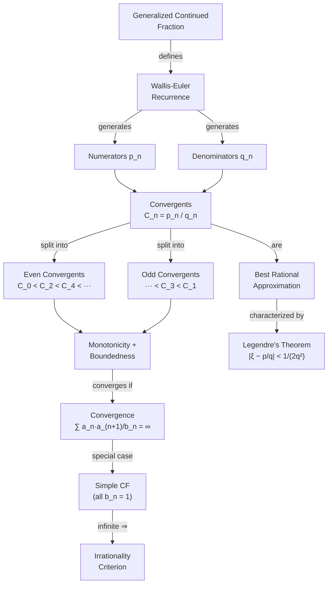

# Continued Fraction Convergents

When we have [[infinite-continued-fractions|continued fractions]] with both positive and negative terms, the partial sums may oscillate and can even be undefined (of course, because of denominators becoming $0$).

## Wallis-Euler Recurrence Relations

Consider a generalized continued fraction with partial numerators $b_n$ and partial denominators $a_n$, where $a_n, b_n > 0$ for $n \geq 1$.

> [!definition] Wallis-Euler Recurrence
> Define the ==numerator and denominator sequences== $(p_n)$ and $(q_n)$ by the recurrences:
>
> $$
> p_n = a_n \, p_{n-1} + b_n \, p_{n-2}, \qquad p_{-1} = 1, \quad p_0 = a_0,
> $$
>
> $$
> q_n = a_n \, q_{n-1} + b_n \, q_{n-2}, \qquad q_{-1} = 0, \quad q_0 = 1.
> $$

In particular:

$$
p_1 = a_1 \, p_0 + b_1 \, p_{-1} = a_1 a_0 + b_1,
$$

$$
q_1 = a_1.
$$

The $n$-th **convergent** is then

$$
C_n = \frac{p_n}{q_n},
$$

which equals the continued fraction truncated %%clarification: "sum till $n$ terms" in the original%% at the $n$-th level.

## Convergents as Rational Approximations

> [!theorem] Convergents Equal Truncated Continued Fractions
> If
>
> $$
> C_n = a_0 + \cfrac{b_1}{a_1 + \cfrac{b_2}{a_3 + \cdots + a_n}},
> $$
>
> then $C_n = \dfrac{p_n}{q_n}$, where $p_n$ and $q_n$ satisfy the Wallis-Euler recurrence above.

## Relatively Prime Integers and Diophantine Equations

> [!tip] Application to Diophantine Equations
> If $a \in \mathbb{N}$ and $b \in \mathbb{N}$ are ==relatively prime==, then the linear Diophantine equation
>
> $$
> ax - by = c
> $$
>
> has infinitely many integer solutions.

## Irrationality via Continued Fractions

You can prove a number is irrational by showing its continued fraction representation has infinitely many terms. %%clarification: a rational number always has a finite simple continued fraction, so an infinite simple CF must represent an irrational number%%

## Monotonicity of Convergents

> [!theorem] Even and Odd Convergent Monotonicity
> Let
>
> $$
> a_0 + \cfrac{b_1}{a_1 + \cfrac{b_2}{a_2 + \cdots}}
> $$
>
> be a continued fraction with $a_n, b_n > 0$. Let $j$ be even and $k$ be odd. Then:
>
> $$
> C_0 < C_2 < C_4 < \cdots < C_j < \cdots < C_k < \cdots < C_3 < C_1.
> $$

This means the ==odd convergents approach the limit from above== and the ==even convergents approach from below==. Since both subsequences are monotone and bounded, the limit exists.

Hence the continued fraction converges if and only if

$$
\lim_{n \to \infty} C_{2n+1} = \lim_{n \to \infty} C_{2n},
$$

i.e., the limits of the odd and even convergents agree.

Moreover,

$$
C_{2n} - C_{2n-1} = \frac{-b_1 b_2 \cdots b_{2n}}{q_{2n} \, q_{2n-1}} \to 0 \quad \text{as } n \to \infty.
$$

## Convergence Criterion

> [!theorem] Convergence of Generalized Continued Fractions
> The above monotonicity holds and the continued fraction converges if
>
> $$
> \sum_{n=1}^{\infty} \frac{a_n \, a_{n+1}}{b_n} = \infty.
> $$

> [!tip] Simple Continued Fractions Always Converge
> ==Infinite simple continued fractions== (where all $b_n = 1$) ==always converge==, since the convergence condition reduces to $\sum a_n a_{n+1} = \infty$, which holds whenever $a_n \geq 1$.

## Representation of Irrationals

Any irrational number can be represented by a sequence $\xi_0, \xi_1, \xi_2, \ldots$ such that

$$
\xi_n = a_n + \frac{b_{n+1}}{\xi_{n+1}},
$$

for sequences $a_n, b_n$ with $\displaystyle\sum_{n=1}^{\infty} \frac{a_n a_{n+1}}{b_n} = \infty$. Then $\xi_0$ is the continued fraction of $a_n, b_n$.

> [!example] $\sqrt{3}$ via Continued Fraction
> We have $\sqrt{3} = 1.7320\ldots$, so $a_0 = 1$. Then:
>
> $$
> \xi_1 = \frac{b_1}{\xi_0 - a_0} = \frac{1}{\sqrt{3} - 1} = \frac{1 + \sqrt{3}}{2} \approx 1.366, \quad \Rightarrow a_1 = 1.
> $$
>
> $$
> \xi_2 = \frac{1}{\frac{1+\sqrt{3}}{2} - 1} = \cdots
> $$

## Best Rational Approximation

The convergents also give the ==best rational approximations== of an irrational number.

> [!example] Convergents of $\pi$
> $$
> 3 \to \frac{22}{7} \to \frac{333}{106} \to \frac{355}{113}.
> $$
>
> These are the first four convergents of $\pi$.

In fact, each convergent is the best approximation and vice versa.

> [!definition] Best Rational Approximation
> A fraction $p/q$ is the **best approximation** of $\xi$ if for all rational $a/b \neq p/q$ with $1 \leq b \leq q$:
>
> $$
> |q\xi - p| < |b\xi - a|.
> $$

Essentially, if there are large partial quotients $a_k$, then the convergents before them give particularly good approximations.

> [!tip] The Golden Ratio is the "Most Irrational" Number
> Since $\phi = [1; 1, 1, 1, \ldots]$ has ==all partial quotients equal to $1$== (the smallest possible), its convergents grow as slowly as possible. This makes $\phi$ the hardest irrational to approximate by rationals — the =="most irrational" number==.

## Concept Map

## See Also

- [[infinite-continued-fractions|Infinite Continued Fractions]]
- [[periodic-continued-fractions|Periodic Continued Fractions]] — Lagrange's theorem and the palindromic CF of $\sqrt{d}$
- [[euler-continued-fraction-formula|Euler's Continued Fraction Formula]]
- [[convergent-sequences|Convergent Sequences]]
- [[legendres-approximation-theorem|Legendre's Approximation Theorem]]
