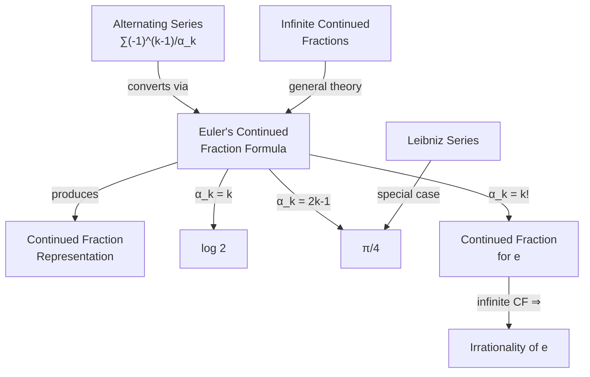

# Euler's Continued Fraction Formula

## Theorem

> [!theorem] Euler's Continued Fraction Formula
> Let $\alpha_1, \alpha_2, \alpha_3, \ldots$ be nonzero with $\alpha_k \neq \alpha_{k-1}$ for all $k$. Then
>
> $$
> \sum_{k=1}^{\infty} \frac{(-1)^{k-1}}{\alpha_k} = \cfrac{1}{\alpha_1 + \cfrac{\alpha_1^2}{\alpha_2 - \alpha_1 + \cfrac{\alpha_2^2}{\alpha_3 - \alpha_2 + \cfrac{\alpha_3^2}{\ddots}}}}
> $$
>
> as long as the series converges.

More precisely, for every sequence $\alpha_1, \alpha_2, \ldots, \alpha_k \neq 0$:

$$
\sum_{k=1}^{n} \frac{(-1)^{k-1}}{\alpha_1 \cdots \alpha_k} = \cfrac{1}{\alpha_1 + \cfrac{\alpha_1}{\alpha_2 - 1 + \cfrac{\alpha_2}{\alpha_3 - 1 + \cdots}}}
$$

and you can take $k \to \infty$.

%%clarification: The scan shows two slightly different forms. The first (Scan 2) uses the alternating series $\sum (-1)^{k-1}/\alpha_k$ with squares in the continued fraction. The second (Scan 3) uses products $\alpha_1 \cdots \alpha_k$ in the denominators. Both are forms of Euler's continued fraction formula.%%

## Applications

This can be used to prove the continued fraction of many alternating series.

> [!example] Continued Fraction for $\log 2$
> Applying the formula to the alternating harmonic series $\sum_{k=1}^{\infty} \frac{(-1)^{k-1}}{k}$:
>
> $$
> \log 2 = \cfrac{1}{1 + \cfrac{1^2}{1 + \cfrac{2^2}{1 + \cfrac{3^2}{\ddots}}}}.
> $$

> [!example] Continued Fraction for $\pi/4$
> Similarly, from the [[pi-formulas-from-arctangent|Leibniz series]] $\sum_{k=0}^{\infty} \frac{(-1)^k}{2k+1}$, one obtains a continued fraction for $\frac{\pi}{4}$.

## Continued Fraction for $e$ and Irrationality

Using the general formula, we can find a continued fraction for $e$.

Since

$$
1 - e^{-1} = \frac{1}{1} - \frac{1}{1 \cdot 2} + \frac{1}{1 \cdot 2 \cdot 3} - \cdots,
$$

applying the formula gives:

$$
\frac{e - 1}{e} = \cfrac{1}{1 + \cfrac{1}{1 + \cfrac{2}{2 + \cfrac{3}{\ddots}}}}.
$$

> [!tip] Irrationality of $e$
> ==This continued fraction also proves that $e$ is irrational==, since the continued fraction is infinite (a rational number would have a finite continued fraction representation).

## Concept Map

## See Also

- [[infinite-continued-fractions|Infinite Continued Fractions]]
- [[exponential-logarithm-and-euler-constant|Exponential, Logarithm, and Euler Constant]]
- [[pi-formulas-from-arctangent|Pi Formulas from Arctangent]]
- [[alternating-series-product-identity|Alternating Series Product Identity]]
