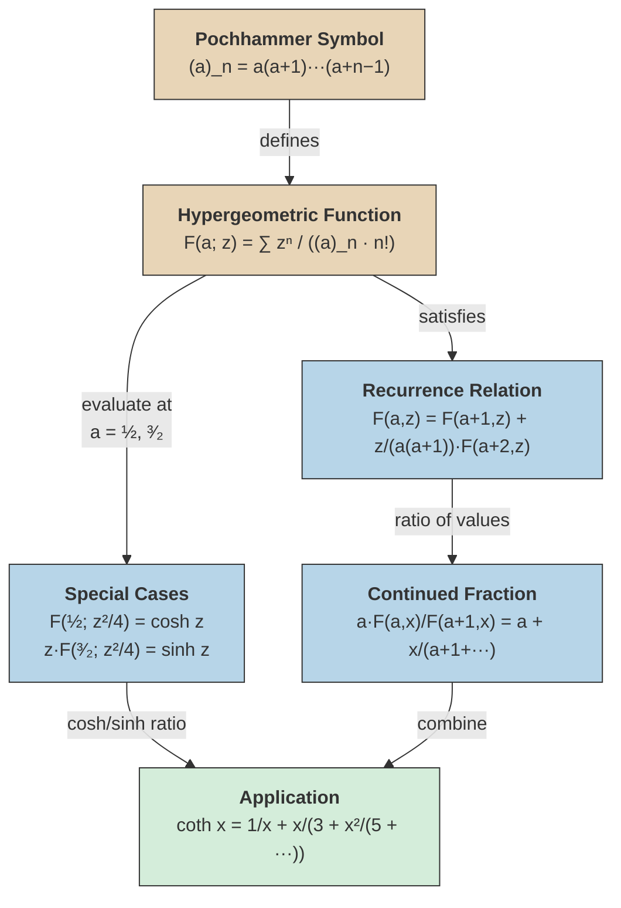

# Hypergeometric Function

## Definition

> [!definition] Confluent Hypergeometric Function
> The confluent hypergeometric function (Kummer's function) is defined by
>
> $$
> F(a; z) = \sum_{n=0}^{\infty} \frac{1}{(a)_n} \frac{z^n}{n!},
> $$
>
> where $(a)_n$ is the **Pochhammer symbol** (rising factorial):
>
> $$
> (a)_n := \begin{cases} 1 & \text{if } n = 0, \\ a(a+1)(a+2)\cdots(a+n-1) & \text{if } n \geq 1. \end{cases}
> $$

%%clarification: The scan writes $(a)_n$ as "some function of $a$" with the Pochhammer definition. The notation $F(a; z)$ with a single parameter $a$ indicates the confluent (Kummer-type) hypergeometric function ${}_0F_1(; a; z)$ rather than the full Gauss ${}_2F_1$.%%

## Special Cases

> [!example] Hyperbolic Functions
> $$
> F\!\left(\tfrac{1}{2};\, \tfrac{z^2}{4}\right) = \cosh z, \qquad z\, F\!\left(\tfrac{3}{2};\, \tfrac{z^2}{4}\right) = \sinh z.
> $$

%%clarification: These are marked with a circled asterisk ($\circledast$) in the scan, referenced later in the $\coth$ derivation.%%

## Recurrence Relation

The hypergeometric function satisfies the recurrence:

$$
F(a, z) = F(a+1, z) + \frac{z}{a(a+1)} F(a+2, z).
$$

## Continued Fraction Representation

From the recurrence relation, the ratio of consecutive hypergeometric values gives a continued fraction:

$$
\frac{a\, F(a, x)}{F(a+1, x)} = a + \cfrac{x}{a+1 + \cfrac{x}{a+2 + \cfrac{x}{a+3 + \cdots}}}.
$$

## Application: Continued Fraction for $\coth$

Using the special cases ($\circledast$) and the continued fraction above:

$$
\coth x = \frac{1}{x} + \cfrac{x}{3 + \cfrac{x^2}{5 + \cfrac{x^2}{7 + \cdots}}}.
$$

%%clarification: This follows from $\coth x = \cosh x / \sinh x$ and applying the ratio formula with the appropriate parameter values.%%

## Concept Map

The warm nodes (definition, Pochhammer) provide the foundation. The cool nodes show the two independent tools — special cases and the continued fraction from the recurrence. Both converge (green) to derive the $\coth$ continued fraction.

## See Also

- [[periodic-continued-fractions|Periodic Continued Fractions]] — irrationality of $\coth x$ and $e^q$ via the CF above
- [[gamma-and-beta-functions|Gamma and Beta Functions]]
- [[infinite-continued-fractions|Infinite Continued Fractions]]
- [[euler-continued-fraction-formula|Euler's Continued Fraction Formula]]
- [[continued-fraction-convergents|Continued Fraction Convergents]]
