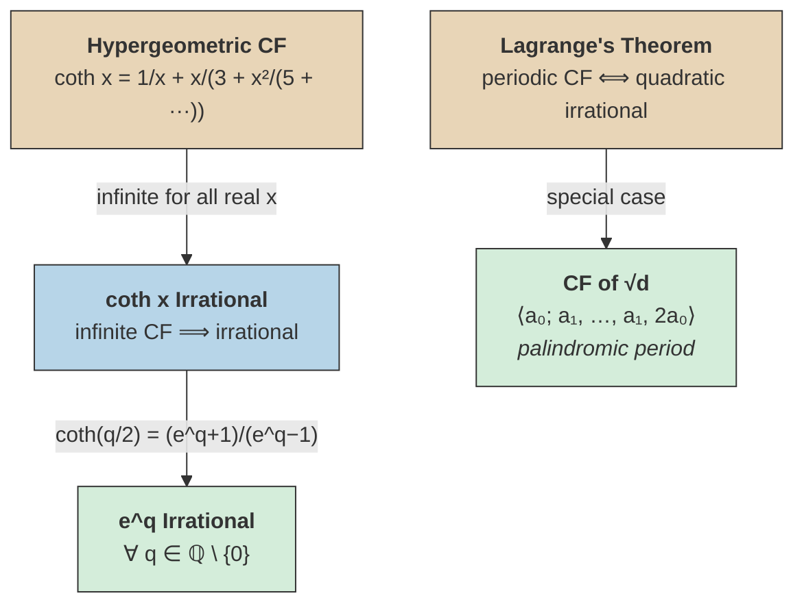

# Periodic Continued Fractions

## Irrationality of $\coth x$ and $e^q$

The [[hypergeometric-function|hypergeometric function]] gives a continued fraction expansion of $\coth x$ valid for all $x = $ real:

$$
\coth x = \frac{e^{2x} + 1}{e^{2x} - 1} = \frac{1}{x} + \cfrac{x}{3 + \cfrac{x^2}{5 + \cfrac{x^2}{7 + \cdots}}}.
$$

Since this is an infinite [[continued-fraction-convergents|continued fraction]] for all real $x$, it follows that ==$\coth x$ is irrational for all real $x$==.

> [!theorem] Irrationality of $e^q$
> $e^q$ is irrational for every nonzero rational number $q$.

> [!proof]-
> Suppose $e^q$ were rational for some $q \in \mathbb{Q} \setminus \{0\}$. Write $x = q/2$. Then
>
> $$
> \coth x = \coth\!\left(\frac{q}{2}\right) = \frac{e^q + 1}{e^q - 1},
> $$
>
> which would be a ratio of rationals, hence rational. But $\coth x$ is irrational for all real $x$. Contradiction.

## Lagrange's Theorem

> [!theorem] Lagrange's Theorem (Periodic Continued Fractions)
> An irrational number has a ==periodic simple continued fraction== if and only if it is a **quadratic irrational** — that is, a solution of a quadratic equation with integer coefficients. %%clarification: "quadratic irrationals" are defined in the scan as irrational numbers that are solutions of quadratic equations with integer coefficients%%

## Continued Fraction of $\sqrt{d}$

For a positive non-square integer $d$, the simple continued fraction of $\sqrt{d}$ has a particularly elegant structure:

$$
\sqrt{d} = \langle a_0;\, a_1, a_2, a_3, \ldots, a_3, a_2, a_1, 2a_0 \rangle,
$$

where $a_0 = \lfloor \sqrt{d} \rfloor$ and the sequence $a_1, a_2, \ldots, a_1, 2a_0$ repeats. The periodic part has a ==palindromic structure==: the partial quotients (excluding the final $2a_0$) read the same forwards and backwards.

> [!example] Continued Fractions of Small Square Roots
> $$
> \sqrt{2} = \langle 1;\, \overline{2} \rangle, \qquad \sqrt{3} = \langle 1;\, \overline{1, 2} \rangle, \qquad \sqrt{5} = \langle 2;\, \overline{4} \rangle, \qquad \sqrt{7} = \langle 2;\, \overline{1, 1, 1, 4} \rangle.
> $$

## Concept Map

The warm nodes (hypergeometric CF, Lagrange's theorem) are the foundational tools. The cool node shows the intermediate irrationality result, and the green nodes are the two main conclusions: irrationality of $e^q$ and the palindromic structure of $\sqrt{d}$.

## See Also

- [[quadratic-integers-and-fields|Quadratic Integers and Fields]] — the rings $\mathbb{Z}[\sqrt{d}]$ and fields $\mathbb{Q}[\sqrt{d}]$
- [[infinite-continued-fractions|Infinite Continued Fractions]] — basics of continued fractions, including $\sqrt{2}$ and $\phi$ examples
- [[continued-fraction-convergents|Continued Fraction Convergents]] — convergent theory and irrationality criteria
- [[hypergeometric-function|Hypergeometric Function]] — derives the $\coth$ continued fraction
- [[euler-continued-fraction-formula|Euler's Continued Fraction Formula]]
