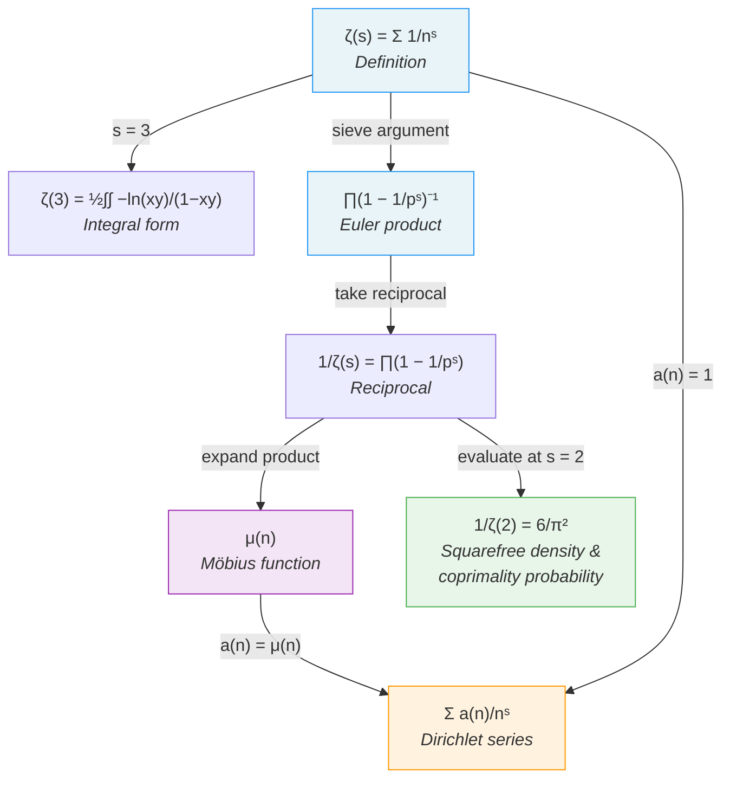

# Riemann Zeta Function

The Riemann zeta function is defined for $s > 1$ by

$$
\zeta(s) = \sum_{n=1}^{\infty} \frac{1}{n^s}.
$$

## Integral Representation of $\zeta(3)$

The value $\zeta(3)$ %%known as Apéry's constant%% admits the double integral representation

$$
\zeta(3) = \frac{1}{2} \int_0^1 \int_0^1 \frac{-\ln(xy)}{1 - xy} \, dx \, dy.
$$

## Euler Product

The zeta function has a product representation over all primes:

$$
\zeta(s) = \prod_{p \text{ prime}} \left(1 - \frac{1}{p^s}\right)^{-1}.
$$

This is proven by sieve (**Euler's proof**): expand each factor as a geometric series

$$
\left(1 - \frac{1}{p^s}\right)^{-1} = \sum_{k=0}^{\infty} \frac{1}{p^{ks}},
$$

and by the fundamental theorem of arithmetic, the product over all primes recovers every term $1/n^s$ exactly once.

The Euler product immediately implies that ==$\zeta(s) \neq 0$ for $s > 1$==, since no factor in the product vanishes.

## Connection to the Möbius Function

Taking the reciprocal of the Euler product gives

$$
\frac{1}{\zeta(s)} = \prod_{p \text{ prime}} \left(1 - \frac{1}{p^s}\right) = \sum_{n=1}^{\infty} \frac{\mu(n)}{n^s},
$$

where $\mu$ is the [[mobius-function|Möbius function]]. This identity is fundamental to analytic number theory and is a special case of a [[dirichlet-series|Dirichlet series]].

## Concept Map

## See Also

- [[mobius-function|Möbius Function]] — the arithmetic function appearing in $1/\zeta(s)$
- [[dirichlet-series|Dirichlet Series]] — the general framework for series of the form $\sum a(n)/n^s$
- [[zeta-function-in-probability|Zeta Function in Probability]] — probabilistic interpretations via $\zeta(2)$
