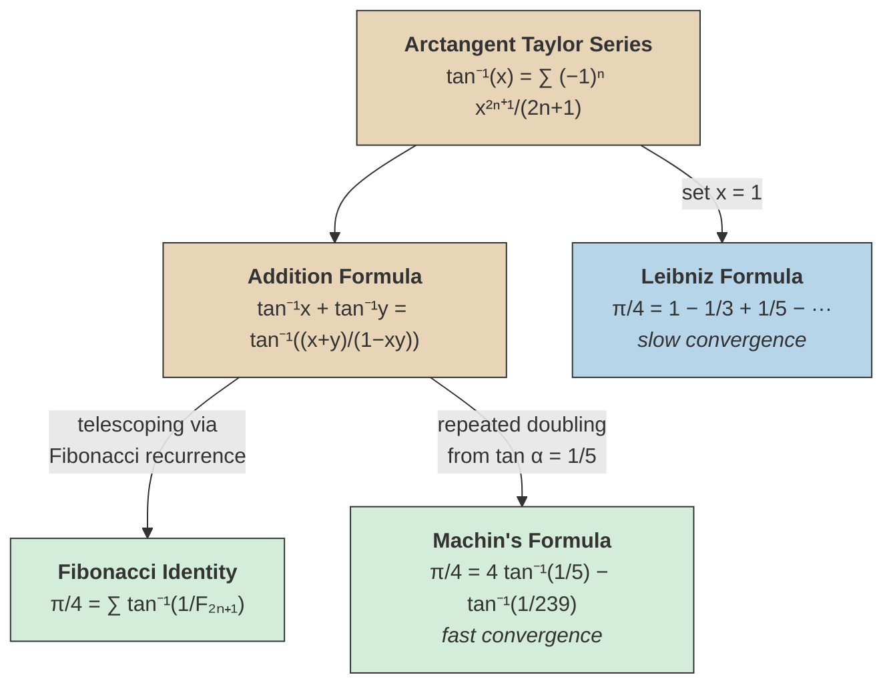

# Pi Formulas from Arctangent

Both formulas below use the [[arctangent-series|arctangent addition formula]] to decompose $\pi/4$ into sums of arctangents of small arguments, producing series that converge much faster than the [[arctangent-series|Leibniz formula]].

The warm nodes are the foundational tools from the [[arctangent-series|Arctangent Series]]. The green nodes are the two fast-converging π formulas derived in this note; the blue node is the slow Leibniz baseline they improve upon.

## Fibonacci Arctangent Identity

Recall from the [[arctangent-series|Arctangent Series]] that:

$$\frac{\pi}{4} = \tan^{-1}\frac{1}{2} + \tan^{-1}\frac{1}{3}$$

Observe that $2 = F_3$ and $3 = F_4$, where $F_k$ denotes the $k$-th Fibonacci number. Applying the arctangent addition formula repeatedly to break each term into further arctangents of reciprocal Fibonacci numbers:

$$\frac{\pi}{4} = \tan^{-1}\frac{1}{F_3} + \tan^{-1}\frac{1}{F_4} = \tan^{-1}\frac{1}{F_3} + \tan^{-1}\frac{1}{F_5} + \tan^{-1}\frac{1}{F_6} + \cdots$$

%%clarification: This telescoping works because of the identity $\tan^{-1}(1/F_{2k}) = \tan^{-1}(1/F_{2k+1}) + \tan^{-1}(1/F_{2k+2})$, which follows from the Fibonacci identity $F_{2k} \cdot F_{2k+3} = F_{2k+1} \cdot F_{2k+2} - 1$ (a consequence of the Cassini identity $F_{n-1}F_{n+1} - F_n^2 = (-1)^n$) and the arctangent addition formula.%%

> [!abstract] Theorem (Fibonacci Arctangent Identity)
> $$\frac{\pi}{4} = \sum_{n=1}^{\infty} \tan^{-1}\frac{1}{F_{2n+1}}$$
>
> where $F_k$ denotes the $k$-th Fibonacci number ($F_1 = 1, F_2 = 1, F_3 = 2, F_4 = 3, F_5 = 5, \ldots$).

^fibonacci-arctangent-identity

> [!info]- Connection to the Fibonacci spiral
> The scan includes a sketch suggesting the Fibonacci spiral. Each successive arctangent $\tan^{-1}(1/F_{2n+1})$ corresponds to a smaller angle, mirroring the spiral's tightening turns.

## Machin's Formula

> [!abstract] Theorem (Machin's Formula, 1706)
> $$\frac{\pi}{4} = 4\tan^{-1}\frac{1}{5} - \tan^{-1}\frac{1}{239}$$

^machins-formula

> [!proof]- Derivation
> Let $\alpha = \tan^{-1}(1/5)$. Using the double-angle formula for tangent:
>
> $$\tan 2\alpha = \frac{2 \cdot \frac{1}{5}}{1 - \frac{1}{25}} = \frac{2/5}{24/25} = \frac{5}{12}$$
>
> Doubling again:
>
> $$\tan 4\alpha = \frac{2 \cdot \frac{5}{12}}{1 - \frac{25}{144}} = \frac{10/12}{119/144} = \frac{120}{119}$$
>
> Since $\tan 4\alpha = 120/119 > 1$, we have $4\alpha > \pi/4$, so $4\alpha - \pi/4 > 0$. Compute:
>
> $$\tan\!\left(4\alpha - \frac{\pi}{4}\right) = \frac{\tan 4\alpha - 1}{1 + \tan 4\alpha} = \frac{120/119 - 1}{1 + 120/119} = \frac{1/119}{239/119} = \frac{1}{239}$$
>
> Therefore $4\alpha - \pi/4 = \tan^{-1}(1/239)$, giving $\pi/4 = 4\alpha - \tan^{-1}(1/239)$.

## Fast-Converging Series for $\pi$

Expanding each arctangent in Machin's formula via the [[arctangent-series|arctangent Taylor series]]:

$$\frac{\pi}{4} = 4\sum_{n=0}^{\infty}\frac{(-1)^n}{(2n+1) \cdot 5^{2n+1}} - \sum_{n=0}^{\infty}\frac{(-1)^n}{(2n+1) \cdot 239^{2n+1}}$$

Equivalently:

> [!abstract] Corollary (Machin's Series for $\pi$)
> $$\pi = 16\sum_{n=0}^{\infty}\frac{(-1)^n}{(2n+1) \cdot 5^{2n+1}} - 4\sum_{n=0}^{\infty}\frac{(-1)^n}{(2n+1) \cdot 239^{2n+1}}$$

^machins-series

> [!example] First few terms
> Writing out the first several terms explicitly:
>
> $$\pi = 16\!\left(\frac{1}{5} - \frac{1}{3 \cdot 5^3} + \frac{1}{5 \cdot 5^5} - \frac{1}{7 \cdot 5^7} + \cdots\right) - 4\!\left(\frac{1}{239} - \frac{1}{3 \cdot 239^3} + \cdots\right)$$
>
> $$= \frac{16}{5} - \frac{16}{375} + \frac{16}{15625} - \frac{16}{546875} + \cdots - \frac{4}{239} + \frac{4}{40955127} - \cdots$$
>
> $$\approx 3.2 - 0.04267 + 0.001024 - 0.0000293 + \cdots - 0.01674 + 0.0000001 - \cdots$$
>
> Already the first four terms of the $1/5$ series and the first term of the $1/239$ series give $\pi \approx 3.14159\ldots$, correct to five decimal places.

> [!tip] Convergence speed
> ==This series converges far more rapidly than the Leibniz formula.== The powers of $5$ and $239$ in the denominators cause the terms to shrink geometrically. Machin used this formula in 1706 to compute $\pi$ to 100 decimal places by hand.

%%clarification: Machin's formula was historically significant because it made hand computation of many digits of $\pi$ feasible. It and its generalizations (Machin-like formulas) were the primary method for computing $\pi$ from the 18th century until the advent of modern algorithms like the Chudnovsky formula.%%

## See Also

- [[arctangent-series|Arctangent Series]] -- the foundational Taylor series and addition formula
- [[power-series|Power Series]] -- general power series theory
- [[pi-and-square-free-integers|Pi and Square-Free Integers]] -- $\pi$ arising from the Basel problem
- [[eulers-product-formula-and-wallis|Euler's Product Formula and Wallis's Formula]] -- product representations of $\pi$
- [[exponential-logarithm-and-euler-constant|Exponential Logarithm and Euler Constant]] -- related constants and series
