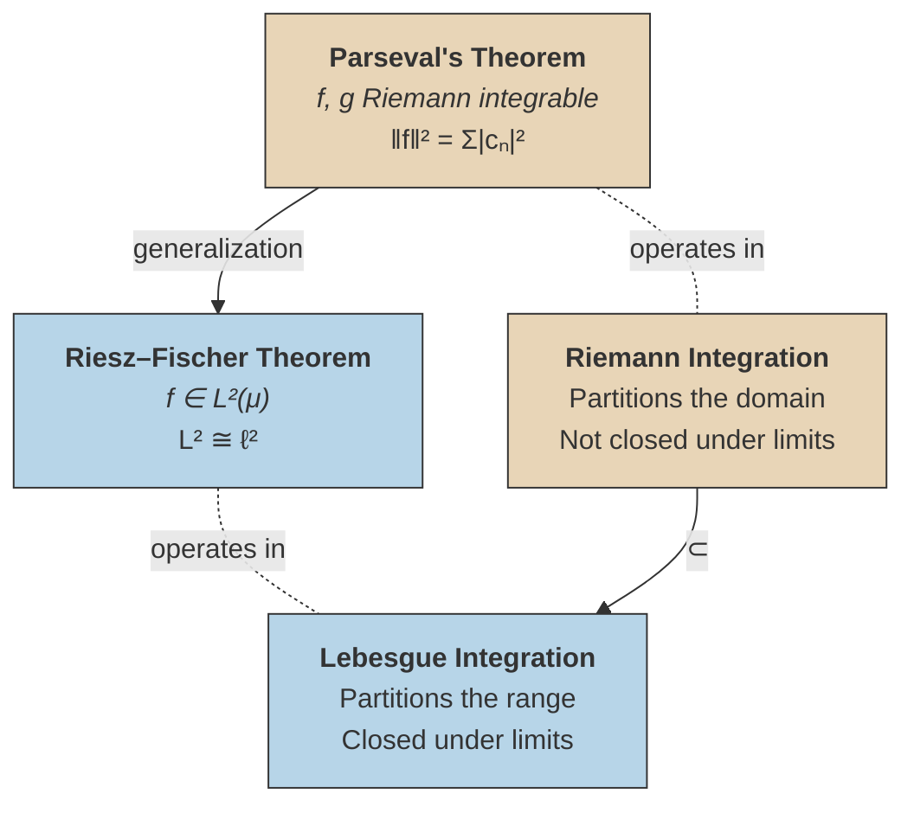
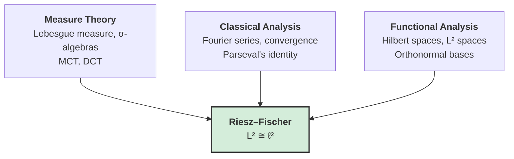

# Riesz–Fischer Theorem

## The Closure Problem

> [!warning] Fundamental Defect of the Riemann Integral
> Limits of Riemann-integrable functions need not be Riemann integrable. You can build a sequence of perfectly good Riemann-integrable functions whose pointwise limit falls outside the class. The space of Riemann-integrable functions is ==not closed under limits==.

Lebesgue integration fixes this. Limits of Lebesgue-integrable functions are Lebesgue-integrable — guaranteed by the [[lebesgue-integration|Monotone Convergence Theorem]] and the [[dominated-convergence-theorem|Dominated Convergence Theorem]]. This closure under limits is what makes $L^2$ a ==complete== space.

On the usual real line with Lebesgue measure, the two integrals agree whenever the Riemann integral exists: every Riemann-integrable function is Lebesgue-integrable, and the values match. But the Lebesgue class is strictly larger.

## Theorem (Riesz–Fischer)

> [!abstract] Theorem
> Let $\{e^{inx}/\sqrt{2\pi}\}_{n \in \mathbb{Z}}$ be the standard orthonormal system on $[-\pi, \pi]$.
>
> **(i)** If $f \in \mathscr{L}^2([-\pi, \pi])$ with Fourier coefficients
>
> $$c_n = \frac{1}{2\pi}\int_{-\pi}^{\pi} f(x) \, e^{-inx} \, dx,$$
>
> then $(c_n) \in \ell^2(\mathbb{Z})$ and the partial sums $S_N f(x) = \sum_{n=-N}^{N} c_n \, e^{inx}$ converge in the $L^2$ norm:
>
> $$\lim_{N \to \infty} \|f - S_N f\|_2 = 0.$$
>
> **(ii)** Conversely, if $(c_n)_{n \in \mathbb{Z}} \in \ell^2(\mathbb{Z})$, then there exists $f \in \mathscr{L}^2([-\pi, \pi])$ whose Fourier coefficients are exactly the $c_n$.
>
> **(iii)** The Fourier coefficient map $f \mapsto (c_n)$ is an ==isometric isomorphism==:
>
> $$\mathscr{L}^2([-\pi, \pi]) \cong \ell^2(\mathbb{Z}),$$
>
> with Parseval's identity:
>
> $$\frac{1}{2\pi}\int_{-\pi}^{\pi} |f(x)|^2 \, dx = \sum_{n=-\infty}^{\infty} |c_n|^2.$$

^riesz-fischer-theorem

## The Big Picture: From Riemann to Lebesgue, Parseval to Riesz–Fischer

The relationship between these four ideas forms a precise conceptual square:

> [!info]- Reading This Diagram
> - **Right column** (warm): the classical Riemann world. Parseval's theorem gives the norm identity $\|f\|^2 = \sum |c_n|^2$ for Riemann-integrable functions.
> - **Left column** (cool): the modern Lebesgue world. Riesz–Fischer upgrades the norm identity to a full isometric isomorphism $L^2 \cong \ell^2$.
> - **Top arrow**: Parseval generalizes to Riesz–Fischer when we enlarge the function space from Riemann-integrable to $L^2$.
> - **Bottom arrow**: every Riemann-integrable function is Lebesgue-integrable ($\mathscr{R} \subset \mathscr{L}^1 \subset \mathscr{L}^2$ on bounded domains).

## Why Completeness Is the Key

> [!question] What does Riesz–Fischer actually add beyond Parseval?
> Parseval's theorem already tells us that the Fourier coefficient map $f \mapsto (c_n)$ is an **isometry** on Riemann-integrable functions.

The answer is ==surjectivity==. Parseval says the map preserves norms, but it does not guarantee that every $\ell^2$ sequence is the coefficient sequence of some Riemann-integrable function. In fact, it isn't — there are $\ell^2$ sequences whose "function" is not Riemann integrable.

The issue is completeness. The Riemann-integrable functions under the $L^2$ norm form an inner product space, but it is **incomplete**: there are Cauchy sequences (in the $L^2$ norm) that converge to a function outside the space. This is exactly the same problem that makes $\mathbb{Q}$ inadequate for analysis — you need $\mathbb{R}$ (the completion) to do calculus properly.

> [!tip] The Punchline
> $L^2(\mu)$ is the completion. It is a **Hilbert space**: a complete inner product space. In a Hilbert space, every orthonormal basis spans the entire space, so the map $f \mapsto (c_n)$ is not just norm-preserving but ==onto==. That is Riesz–Fischer.

## The Three Pillars

The Riesz–Fischer theorem sits at the intersection of three mathematical traditions:

- **Measure theory** provides the integration machinery (Lebesgue measure) and the convergence theorems (MCT, DCT) that guarantee $L^2$ is closed under limits.
- **Classical analysis** provides the Fourier series framework and Parseval's identity — the norm-preserving property of the coefficient map.
- **Functional analysis** provides the abstract structure: $L^2$ is a Hilbert space, $\{e^{inx}/\sqrt{2\pi}\}$ is an orthonormal basis, and in a Hilbert space every complete orthonormal system gives an isometric isomorphism with $\ell^2$.

Riesz–Fischer is where these three threads converge. It is not merely a technical extension of Parseval's theorem — it is the statement that Fourier analysis has a ==complete==, ==rigorous==, ==infinite-dimensional geometric== foundation.

## See Also
- [[parsevals-theorem|Parseval's Theorem]]
- [[fourier-series|Fourier Series]]
- [[lebesgue-integration|Lebesgue Integration]]
- [[dominated-convergence-theorem|Dominated Convergence Theorem]]
- [[lebesgue-measure|Lebesgue Measure]]
