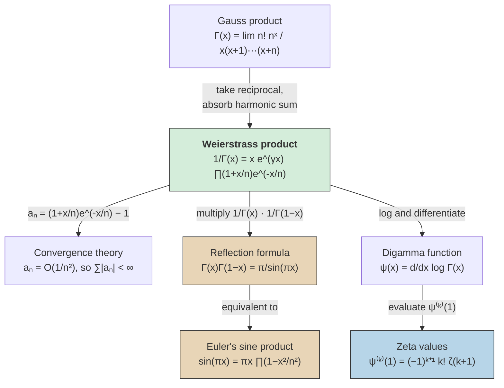

# Weierstrass Product for the Gamma Function

## The Product Formula

> [!abstract] Theorem (Weierstrass Product)
> For all $x$ not a non-positive integer:
>
> $$\frac{1}{\Gamma(x)} = x\, e^{\gamma x} \prod_{n=1}^{\infty} \left(1 + \frac{x}{n}\right) e^{-x/n}$$
>
> where $\gamma$ is the Euler-Mascheroni constant.

^weierstrass-product-gamma

The product converges absolutely for all $x \in \mathbb{C}$, making $1/\Gamma$ an **entire function** with simple zeros at $x = 0, -1, -2, \ldots$

## Why the Convergence Factors Are Needed

The naive product $\prod(1 + x/n)$ diverges because $\sum |x/n| = \infty$. The exponential factors $e^{-x/n}$ correct this. To see why, note that for each factor:

$$\left(1 + \frac{x}{n}\right)e^{-x/n} = 1 + a_n$$

where, expanding the logarithm:

$$\log(1 + a_n) = \log\!\left(1 + \frac{x}{n}\right) - \frac{x}{n} = -\frac{x^2}{2n^2} + O\!\left(\frac{1}{n^3}\right).$$

So $a_n = O(1/n^2)$, which means $\sum |a_n| < \infty$. By the [[infinite-products|convergence criterion for infinite products]], absolute convergence of $\sum |a_n|$ implies absolute convergence of $\prod(1 + a_n)$.

> [!tip] Key Insight
> The convergence factors $e^{-x/n}$ cancel the linear divergence, leaving a quadratic remainder that is summable. This is the simplest instance of the **Weierstrass canonical product** construction: for a function with prescribed zeros $z_n$, include enough terms of $\exp(z/z_n + z^2/2z_n^2 + \cdots)$ to force convergence.

## Connection to the Gauss Product

The [[gamma-and-beta-functions|Gauss product formula]] states:

$$\Gamma(x) = \lim_{n \to \infty} \frac{n!\; n^x}{x(x+1)(x+2)\cdots(x+n)}.$$

To derive the Weierstrass form, take the reciprocal:

$$\frac{1}{\Gamma(x)} = \lim_{n \to \infty} \frac{x(x+1)\cdots(x+n)}{n!\; n^x} = x \lim_{n \to \infty} \frac{1}{n^x}\prod_{k=1}^{n}\left(1 + \frac{x}{k}\right).$$

Writing $n^x = e^{x \ln n} = e^{x(1 + 1/2 + \cdots + 1/n - \gamma + o(1))}$ and absorbing the partial harmonic sum into the product via $e^{x/k}$ factors gives:

$$\frac{1}{\Gamma(x)} = x\, e^{\gamma x} \prod_{n=1}^{\infty}\left(1 + \frac{x}{n}\right)e^{-x/n}.$$

## The Reflection Formula

> [!abstract] Theorem (Euler's Reflection Formula)
> For $x \notin \mathbb{Z}$:
>
> $$\Gamma(x)\,\Gamma(1-x) = \frac{\pi}{\sin(\pi x)}$$

^reflection-formula

This follows directly from the Weierstrass product. Multiply $1/\Gamma(x)$ and $1/\Gamma(1-x)$:

$$\frac{1}{\Gamma(x)\,\Gamma(1-x)} = x\,e^{\gamma x}\prod_{n=1}^{\infty}\left(1+\frac{x}{n}\right)e^{-x/n} \;\cdot\; (1-x)\,e^{-\gamma x}\prod_{n=1}^{\infty}\left(1-\frac{x-1}{n}\right)e^{(x-1)/n}.$$

The $e^{\gamma x}$ and $e^{-\gamma x}$ cancel. After simplification, the product telescopes to:

$$\frac{1}{\Gamma(x)\,\Gamma(1-x)} = x\prod_{n=1}^{\infty}\left(1 - \frac{x^2}{n^2}\right)$$

which is exactly [[eulers-product-formula-and-wallis|Euler's product formula]] for $\sin(\pi x)/\pi$.

> [!tip] Two products, one identity
> The sine product $\sin(\pi x) = \pi x \prod(1 - x^2/n^2)$ is not an independent fact — it *is* the reflection formula, witnessed through the Weierstrass product for $\Gamma$.

## The Digamma Function and Zeta Values

Taking $\log$ of the Weierstrass product and differentiating gives the **digamma function**:

$$\psi(x) = \frac{d}{dx}\log\Gamma(x) = -\gamma - \frac{1}{x} + \sum_{n=1}^{\infty}\left(\frac{1}{n} - \frac{1}{n+x}\right).$$

Differentiating $k$ times:

$$\psi^{(k)}(x) = (-1)^{k+1}\, k!\, \sum_{n=0}^{\infty} \frac{1}{(n+x)^{k+1}}.$$

Evaluating at $x = 1$:

$$\psi^{(k)}(1) = (-1)^{k+1}\, k!\, \zeta(k+1).$$

This reveals that the Weierstrass product for $\Gamma$ **encodes all values of the [[riemann-zeta-function|Riemann zeta function]]** at positive integers $\geq 2$.

## Concept Map

## See Also

- [[infinite-products|Infinite Products]] — convergence theory for $\prod(1+a_n)$
- [[gamma-and-beta-functions|Gamma and Beta Functions]] — Gauss product and the Beta-Gamma relation
- [[eulers-product-formula-and-wallis|Euler's Product Formula and Wallis]] — the sine product that emerges from the reflection formula
- [[riemann-zeta-function|Riemann Zeta Function]] — zeta values encoded in the digamma derivatives
- [[exponential-logarithm-and-euler-constant|Exponential Logarithm and Euler Constant]] — the Euler-Mascheroni constant $\gamma$
